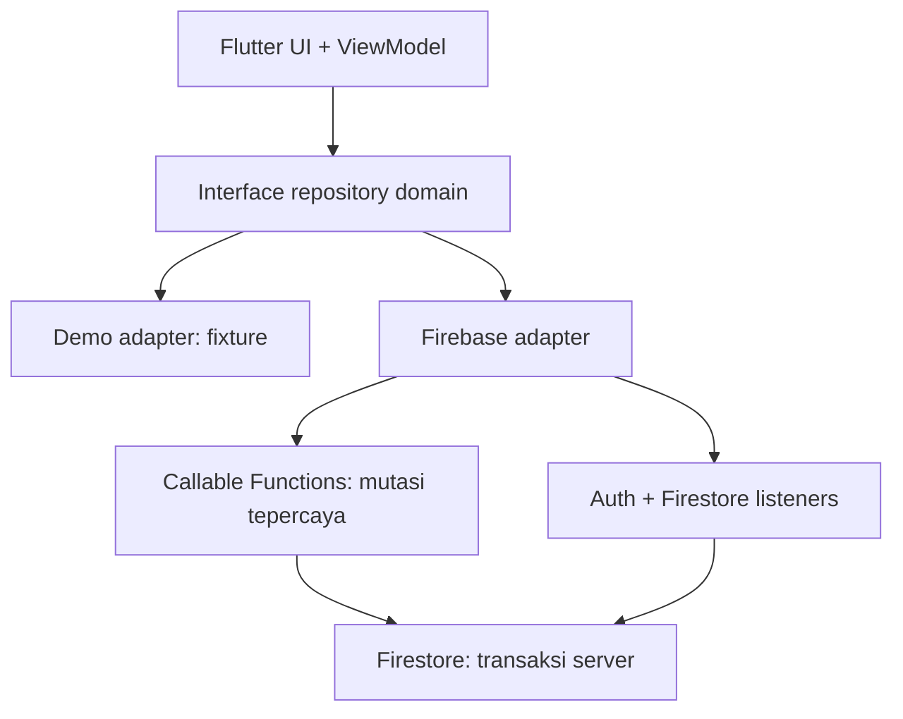
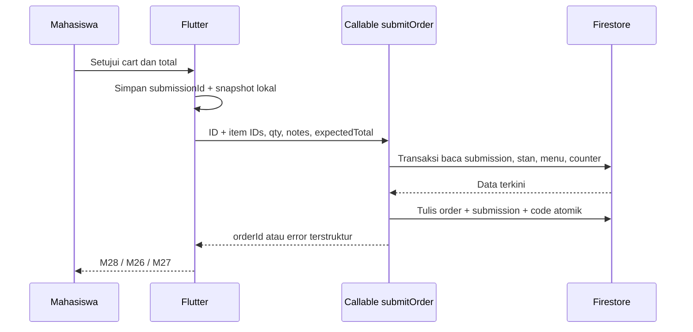

# Roadmap Implementasi — KantinCerdasv2.0.0

**Status:** USULAN arsitektur dan pekerjaan; belum diimplementasikan atau dirilis.
**Tanggal telaah:** 24 September 2026.
**Basis repository:** `main` pada commit [`3d65937`](https://github.com/Doni-15/kantin-cerdas/commit/3d65937ec9d10f36c5d8b979f6e0b49ac7c8cae7).
**Dokumen induk:** [SRS v1](https://github.com/Doni-15/kantin-cerdas/blob/main/docs/SRS_KantinCerdasv1.0.0.md), [Roadmap v1](https://github.com/Doni-15/kantin-cerdas/blob/main/docs/Roadmap_KantinCerdasv1.0.0.md), [README](https://github.com/Doni-15/kantin-cerdas/blob/main/README.md), dan `Modul_Pemrograman_Mobile(1).pdf` yang diberikan bersama permintaan.
**Hasil target:** satu aplikasi Android Flutter dengan dua peran, Firebase Authentication, Cloud Firestore, sinkronisasi dua perangkat, transaksi pemesanan tunai yang divalidasi server, dan jalur demo lokal yang tetap terisolasi.

> **Kejujuran status.** v1 adalah roadmap UI demo, bukan backend yang sudah berjalan. Pada commit yang ditelaah, `apps/mobile/lib/` berisi `app/`, `core/design_system/`, `demo/`, dan `main.dart`; belum ada `features/`, interface repository bisnis, model/DTO pesanan, Firestore, Authentication, Functions, Rules, `test/`, `integration_test/`, ataupun `.github/workflows/`. `KantinCerdasApp` belum memasang `home` atau router. Dua entry point demo ada, tetapi `DemoScope` belum dibaca oleh shell aplikasi. Jadi pekerjaan di bawah **bukan** tugas mengganti fake repository yang sudah lengkap dengan satu baris URL. Selesaikan kontrak dan perilaku v1 yang diperlukan terlebih dahulu. Tidak ada klaim 644 task v1 telah selesai.

## 0. Cara membaca dan batas keputusan

- **Fakta repository** berarti terlihat pada commit di atas. **Aturan v1** berarti tertulis di SRS/roadmap, belum tentu telah dibuat. **Usulan v2** berarti pilihan arsitektur dalam dokumen ini dan dapat diubah lewat keputusan tercatat.
- Tugas berstatus `TODO` sampai ada PR terverifikasi dan merge. `BLOCKED` dipakai hanya untuk keputusan yang memang menunggu persetujuan produk/desain/biaya. `DONE` tidak diberikan hanya karena file sudah ada.
- `KC2-...` adalah ID pekerjaan v2; `KC-...` tetap ID v1. Satu baris task memiliki satu hasil teramati; `PIC`, `Issue`, dan `PR` awalnya `—` dan diisi tim. PR dapat menggabungkan beberapa task kecil yang harus berjalan bersama, tetapi semua ID dicantumkan.
- Pertahankan `design/baseline/` immutable. Baseline KC-DS-20260906 tetap acuan v1. Layar autentikasi dan pesan kegagalan baru memerlukan spesifikasi desain **tambahan**, bukan perubahan diam-diam pada 88 gambar asli.
- **Target v2.0.0 adalah target lingkup**, bukan pernyataan bahwa v1.0.0 sudah dirilis atau bahwa `2.0.0` wajib secara SemVer. Kunci penamaan tag setelah memutuskan apakah perubahan kontrak cukup besar untuk versi major; jangan memindahkan tag yang pernah diterbitkan.

### 0.1 Bukti modul dan pemilihan stack

Nomor halaman berikut adalah **nomor fisik PDF** 176 halaman; angka tercetak di footer modul lebih kecil tiga halaman. Beberapa potongan kode pada PDF merupakan gambar sehingga ekstraksi teks hanya menangkap uraian di sekitarnya.

| Pedoman modul | Halaman PDF | Penerapan KantinCerdas | Batas yang harus dijelaskan |
| --- | --- | --- | --- |
| Flutter/Dart, `go_router`, state `ChangeNotifier` + Provider | sekitar 70–95 | UI Flutter; pertahankan ViewModel per fitur, gunakan `go_router` bila route guard dan deep link diperlukan | Repo sekarang hanya `MaterialApp`, belum ada router atau Provider. Migrasi router perlu satu keputusan agar tidak memakai dua pola. |
| `shared_preferences` untuk data lokal ringan | 96–100 | Boleh untuk onboarding/preferensi perangkat yang tidak sensitif; cart draft butuh penyimpanan lokal terstruktur dan isolasi UID bila harus tahan restart | Jangan simpan password/token atau menganggap ini database transaksi. |
| API eksternal `http` | 114–133 | Tidak wajib untuk Firestore/Auth; FlutterFire SDK bukan REST handler buatan sendiri | AI/API anime di modul bukan persyaratan aplikasi kantin. |
| Firebase Auth Email/Password dan Google; UID pengguna | 134–145 | Auth nyata; Google sebagai opsi setelah SHA dan desain disetujui; UID menjadi ID profil | Peran pengelola **tidak** didapat dari memilih tampilan atau mengetik email tertentu. |
| Cloud Firestore dokumen/koleksi, `snapshots()`, pemetaan data di service | 146–163 | Model typed; adapter Firestore di `data/`; listen order/katalog menurut scope | Path `users/{uid}/...` sendiri tidak mengamankan data; Security Rules harus menegakkan akses. |
| `Start in Test mode` hanya untuk kelas; Production Rules dan signing | 151–152, 164–165 | Mulai dengan rules tertutup dan Emulator Suite; release signing dikelola terpisah | Mode uji memberi akses terlalu luas. Tidak dipakai pada project yang menyimpan pesanan atau data pengguna nyata. |

Stack inti: Flutter **3.44.9** sesuai `.flutter-version` saat telaah, Dart dari SDK tersebut; `firebase_core`, `firebase_auth`, `cloud_firestore`, `cloud_functions`; `provider` bila tim memilih wiring Provider sesuai modul, dengan `ChangeNotifier` yang sudah direncanakan SRS; `go_router` bila diadopsi pada tahap router; Firebase Local Emulator Suite untuk Auth, Firestore, Functions dan pengujian Rules. `google_sign_in` hanya saat tombol Google benar-benar dibuat. Cloud Functions for Firebase 2nd gen dengan TypeScript/Node adalah **tambahan usulan di luar tutorial favorit anime modul** karena harga, status, dan pembayaran memerlukan eksekutor tepercaya. Firebase SDK diberi versi kompatibel yang diuji dengan Flutter terpin, dicatat dalam `pubspec.lock`; jangan menebak nomor versi paket di dokumen. Untuk deployment Functions, Firebase mensyaratkan paket Blaze; tentukan pemilik billing dan batas pengeluaran sebelum deploy. Project emulator dapat dipakai sebelum keputusan biaya. Rujukan: [FlutterFire setup](https://firebase.google.com/docs/flutter/setup), [callable Functions](https://firebase.google.com/docs/functions/callable), [Functions getting started](https://firebase.google.com/docs/functions/get-started).

### 0.2 Aturan yang tidak boleh bergeser ketika data menjadi nyata

| SRS v1 | Kontrak v2 |
| --- | --- |
| BR-01–07 | Satu stan per cart; uang integer rupiah; harga/item/ketersediaan dibaca ulang **di server** saat submit. Harga berubah berarti pengguna meninjau ulang, bukan server diam-diam menagih nilai lain. |
| BR-08–11 | Order mulai `waiting`; reject hanya `waiting`; `completed` hanya sesudah pengelola mengonfirmasi makanan diserahkan **dan** tunai diterima; rejected `notCharged`. |
| BR-09, AT-08–10 | Satu `submissionId` untuk satu snapshot; hasil jaringan tidak pasti mengarah ke lookup. Ketiadaan dokumen sementara tidak otomatis membuktikan kegagalan definitif. |
| BR-12–14 | Antrean stabil; menutup stan tidak menghapus antrean; perubahan menu tidak menghitung ulang order lama. |
| BR-15, S03/S04/S17 | Baca cache boleh diberi label lama; tidak membuat order atau mutasi pengelola secara offline; jangan biarkan penulisan Firestore yang ditunda menyamar sebagai transaksi sukses. |
| BR-16–22 | Filter/asisten lokal tetap deterministik; draft pengaturan disimpan hanya saat `Simpan`; notifikasi/AI tetap di luar target kecuali diberi pekerjaan tersendiri. |

**Batas v2:** belum mencakup QRIS, pembayaran online, saldo, kurir, multistan dalam satu order, pengelolaan stok numerik, AI sungguhan, CRUD tambah/hapus menu, unggah foto, FCM/push produksi, atau laporan keuangan. Ini keputusan scope eksplisit, bukan klaim bahwa fitur tersebut sudah tersedia.

## 1. Peta arsitektur dan perpindahan dari demo



`main.dart` menentukan bootstrap; composition root memasang **satu** `AppDependencies`. Konfigurasi `demo` dan `firebase` memilih adapter **sebelum UI dibuat**. `features/orders/presentation/` membaca `OrderRepository`, tidak pernah mengimpor `FirebaseFirestore` atau `lib/demo/`. Server Functions selalu memeriksa `auth.uid`, role dan `assignedStallId` dari data tepercaya. Rules membatasi baca; tulisan berisiko dari klien ditutup. `DemoStore` tetap untuk golden/unit test dan presentasi tanpa akun. **Syarat boleh menghapus `lib/demo/`:** build Firebase tidak mengimpor demo sama sekali, setiap interface punya adapter nyata, fixture test dipindahkan ke `test/fixtures`, smoke test dua perangkat lulus, dan entry point lama dihapus/diperbarui secara sengaja. Sampai itu terbukti, menghapus folder demo akan merusak entry point yang sekarang ada.

Struktur target bertahap (folder tidak dibuat kosong):

```text
apps/mobile/lib/
  main.dart
  app/{bootstrap,dependencies,router,session}/
  core/design_system/                         # yang sudah ada
  core/{result,clock,formatting}/              # hanya lintas fitur
  features/auth/{data,domain,presentation}/
  features/catalog/{data,domain,presentation}/
  features/cart/{data,domain,presentation}/
  features/orders/{data,domain,presentation}/
  features/stall_management/{data,domain,presentation}/
  features/preferences/{data,domain,presentation}/
  features/assistant/{data,domain,presentation}/
  demo/                                        # adapter demo, sementara
functions/src/{auth,orders,stalls,menus,shared}/
firestore.rules
firestore.indexes.json
firebase.json
```

Aturan batas: `domain` menyimpan enum, invariant, model, repository interface; `data` berisi DTO, mapper, Firestore data source, adapter fake; `presentation` UI/ViewModel. Satu `OrderRepository` melayani kedua peran dengan query berbeda. Jangan membuat dua model order yang berlainan. Pilih **satu** pola routing; modul mengenalkan `go_router`, SRS v1 mengusulkan Navigator. Keputusan `KC2-DEC-03` menetapkan apakah adopsi `go_router` memberi manfaat nyata untuk auth guard dan dua shell. Dark/light tetap mengikuti `ThemeMode.system` yang sudah ada.

### 1.1 Kontrak Dart yang dibuat sebelum integrasi

| Kontrak | Method minimum | Adapter demo → adapter Firebase |
| --- | --- | --- |
| `SessionRepository` | `watchSession`, `signInEmail`, `signInGoogle?`, `signOut`, `loadProfile` | `DemoSession` → Firebase Auth + `users/{uid}`; `unknown/disabled` tidak menjadi mahasiswa otomatis. |
| `CatalogRepository` | `watchStalls`, `watchMenus(stallId)`, `getMenu`, `searchLoadedCatalog` | Fixture → query Firestore; filter lokal jelas lingkup datanya. |
| `CartRepository` | `watchCart`, `add`, `remove`, `undo`, `setLineNote`, `setOrderNote`, `clearIfRevision` | In-memory → draft lokal milik UID; server tidak menganggap cart sebagai harga otoritatif. |
| `OrderRepository` | `submit(SubmitIntent)`, `lookupSubmission`, `watchStudentOrders`, `watchStallOrders`, `watchOrder`, `transition` | Fake idempotent → callable submit/lookup/transition + listeners Firestore. |
| `StallRepository` | `watchStall`, `saveSettings`, `setOpen`, `setAvailability` | Fake → listener + callable berotorisasi. |
| `PreferencesRepository` | `watchFood`, `saveFood` | Fake → `users/{uid}/settings/food` (Rules) atau callable jika butuh konfirmasi server seragam. |
| `RecommendationRepository` | `recommend(localCatalog, criteria)` | Algoritme fixture tetap lokal; tidak menyatakan AI produksi. |

`AppResult<T>` adalah sealed result dengan `success`, `empty`, `offline/stale`, `validationFailure`, `permissionDenied`, `knownFailure`, `unknownOutcome`, dan `conflict`; error Firebase mentah diterjemahkan di adapter. DTO Firestore memiliki `schemaVersion`, `fromFirestore`, `toFirestore` hanya untuk field yang benar-benar boleh dikirim; `Timestamp` dipetakan ke `DateTime` UTC; `int` rupiah tetap `int`. `Order` immutable dari sudut klien. Tidak membocorkan tipe `DocumentSnapshot` ke widget. Test kontrak menjalankan skenario yang sama di adapter fake dan emulator untuk menekan perbedaan perilaku.

## 2. Desain data Firestore v2

Firestore menyimpan **dokumen dan koleksi**, sehingga tabel relasi di bawah menjelaskan *hubungan logis*, bukan foreign key SQL yang ditegakkan otomatis. ID dokumen dipilih sekali dan **tidak** dipakai sebagai rahasia. Semua referensi `uid`, `stallId`, `menuId` dicek pada fungsi server saat menulis order; jangan mengasumsikan Firestore akan menolak referensi yang tidak ada. Semua `createdAt/updatedAt` transaksi berasal dari waktu tepercaya server, disimpan Timestamp UTC; tampilan memakai `Asia/Jakarta`. `schemaVersion` mulai `1` dan parser menghadapi field opsional yang belum ada.

| Entitas | Kardinalitas dan hubungan | Tempat penyimpanan | Sumber kebenaran |
| --- | --- | --- | --- |
| `UserProfile` | satu UID Auth → tepat satu profil aktif; manager → tepat satu stan dalam scope awal | `users/{uid}` | Admin/provisioning tepercaya; UID dari Firebase Auth. |
| `Stall` | satu stan → banyak menu, banyak order, dapat memiliki beberapa manager; setiap manager hanya ditugaskan ke satu stan dalam scope awal | `stalls/{stallId}` | Admin untuk identitas; callable manager untuk buka/estimasi. |
| `MenuItem` | satu menu → tepat satu stan; satu menu → banyak order line historis | `menus/{menuId}` | Admin untuk identitas/harga; callable manager untuk availability. |
| `FoodPreferences` | satu UID → satu preferensi makanan | `users/{uid}/settings/food` | Pengguna pemilik, setelah tombol Simpan. |
| `Cart`/`CartLine` | satu UID → satu draft aktif; satu cart → 0..n line dari **satu** stan | perangkat, namespace UID; bukan Firestore pada fase awal | Client untuk draft, tidak berhak menetapkan harga transaksi. |
| `Submission` | satu UID → banyak percobaan logis; satu submission → nol atau satu order | `users/{uid}/submissions/{submissionId}` | Callable server; key stabil, snapshot digest tetap. |
| `Order` | satu UID mahasiswa + satu stan → banyak order; satu order → 1..n line snapshot | `orders/{orderId}` | Callable server; fakta penjualan dan status. |
| `OrderLine`/`OrderEvent` | satu order → beberapa line dan event, berukuran kecil/terbatas | field array tertanam pada satu order | Server; data historis tidak mengikuti harga menu baru. |
| `SequenceCounter` | satu counter → banyak kode manusia | `system/orderCodeCounter` | Server; hanya untuk kode `KC-...`, tidak untuk hak akses. |

### 2.1 `users/{uid}` — profil, role, dan otorisasi

| Field | Tipe / wajib | Arti, validasi, dan penulis |
| --- | --- | --- |
| Document ID | string UID Auth | Harus sama dengan UID token; dibuat lewat provisioning tepercaya, bukan input UI. |
| `schemaVersion` | int, wajib | Versi schema 1. |
| `displayName` | string, wajib | Nama tampilan; ditetapkan proses pendaftaran yang divalidasi; manager dalam scope awal diprovisi admin. |
| `email` | string, wajib | Email tampilan dari identitas terverifikasi; perubahan disinkronkan lewat proses tepercaya; jangan menyimpan password. |
| `role` | enum `student` / `manager`, wajib | **Tidak** boleh diubah oleh klien. Role baru butuh spesifikasi. |
| `assignedStallId` | string atau null, wajib | Manager harus memiliki ID stan valid; student harus null. Bukan pilihan layar. |
| `active` | bool, wajib | `false` menolak akses berikutnya termasuk fungsi mutasi. |
| `createdAt`, `updatedAt` | Timestamp, wajib | Waktu server. |

Mahasiswa baru memperoleh profil `student` melalui onboarding server setelah sign-in; pengelola **tidak** boleh melakukan self-registration sebagai `manager`. Seed akun Bu Rina dan Doni menggunakan akun uji khusus di emulator; email `example.com` pada v1 bukan akun sungguhan. Saat akun Auth ada tetapi profil belum siap, UI menunjukkan loading/onboarding yang jelas dan melarang membuka shell. Auth membuktikan identitas; `role` + `assignedStallId` tepercaya membuktikan hak akses. `users/{uid}` dibaca pemiliknya saja; daftar pengelola tidak mendapat akses ke profil lengkap mahasiswa. Nama mahasiswa yang perlu ditampilkan pada order disalin sebagai snapshot yang terbatas.

### 2.2 `stalls/{stallId}` dan `menus/{menuId}` — katalog

| Entitas.field | Tipe / wajib | Invariant / kebijakan |
| --- | --- | --- |
| `stalls/{id}.schemaVersion` | int | `1`. |
| `.name`, `.description`, `.location`, `.block` | string | Identitas/label stan; awalnya seed admin, manager belum bisa mengedit profil identitas. |
| `.imageAssetKey` | string? | Kunci aset lokal terdaftar; bukan URL arbitrer. Foto baru/upload memerlukan desain Storage + Rules baru. |
| `.isPublished` | bool | Admin menentukan apakah stan terlihat di katalog; stan `isOpen=false` yang published tetap dapat terlihat sebagai tutup. |
| `.isOpen` | bool | **Manual** menentukan penerimaan pesanan, berbeda dari jadwal. |
| `.prepMinMinutes`, `.prepMaxMinutes` | int | `0 <= min <= max`; pilihan P17: 5–10, 10–15, 15–20 menit. |
| `.scheduleLabel` | string | Informasi saja, misalnya Senin–Jumat 08.00–16.00; tidak otomatis menutup stan. |
| `.version`, `.updatedAt`, `.updatedBy` | int, Timestamp, UID | Version naik pada perubahan, waktu/aktor ditulis server; mendukung expectedVersion P01/P17. |
| `menus/{id}.schemaVersion`, `.stallId` | int, string | Menu menunjuk stan yang ada; ID tidak berubah. |
| `.name`, `.nameNormalized`, `.description` | string | Nama untuk tampilan dan filter lokal; normalisasi bukan search engine. |
| `.imageAssetKey` | string? | Pemetaan dari delapan aset foto yang telah ada. |
| `.priceRupiah` | int | Integer nonnegatif; hanya admin/operasi harga terpisah yang boleh mengubahnya pada scope v2. |
| `.category`, `.tasteTags` | string enum, array string | Metadata filter/asisten; tidak mengklaim informasi alergi/nutrisi. |
| `.prepMinMinutes`, `.prepMaxMinutes` | int | Estimasi per menu saat pemesanan; tidak mengikuti perubahan estimasi stan lampau. |
| `.availability` | `available` / `soldOut` | Hanya manager stan sendiri melalui callable; tidak ada stok numerik. |
| `.isActive`, `.version`, `.updatedAt`, `.updatedBy` | bool, int, Timestamp, UID | Soft visibility/version/timestamp/auditor; perubahan menu tidak otomatis mengubah order lama. |

`imageAssetKey` dipetakan oleh aplikasi ke aset paket lokal; seed delapan menu dan tiga stan mengikuti SRS §6.3. Jika fitur unggah gambar disetujui kemudian, Cloud Storage dan validasi MIME/ukuran/hak distribusi menjadi backlog berbeda. Simpan aturan angka dan visibility dalam fungsi server, bukan hanya switch UI. Harga tidak dikelola pada P15 versi desain saat ini.

### 2.3 `users/{uid}/settings/food` dan `.../notifications`

| Dokumen.field | Tipe | Perilaku |
| --- | --- | --- |
| `food.taste` | enum `spicy` / `notSpicy` / null | Single select sesuai A-06; null berarti belum memilih. |
| `food.maxPriceRupiah`, `food.maxWaitMinutes` | int positif atau null | Null = tanpa batas; selera soft preference, harga/waktu hard limit. |
| `food.updatedAt`, `food.schemaVersion` | Timestamp, int | Simpan hanya pada CTA; kegagalan tidak mengganti state confirmed. |
| `notifications.enabled` | bool | Preferensi aplikasi, terpisah dari izin OS. |
| `notifications.permissionObserved` | enum `unknown/granted/denied` | Hanya tampilan lokal bila permission masih dummy; jangan menulis klaim izin OS yang tidak benar ke cloud. |

Keputusan awal: `food` berada di Firestore dan bisa dibaca hanya oleh pemilik; `notifications` tetap setting aplikasi lokal sampai izin perangkat/FCM benar-benar disetujui. Kolom `notifications` di atas **rancangan siap perluasan**, bukan scope implementasi v2 wajib. Preferensi bisa memakai client write terbatas dengan Rules whitelist field + pengecekan tipe; penulisan offline perlu diblokir di UI dan penanda `hasPendingWrites` tidak boleh dibaca sebagai sukses server. Alternatif callable `saveFood` jika tim ingin seluruh persistensi konsisten menunggu acknowledgement. Tetapkan satu opsi di `KC2-DEC-04`.

### 2.4 Cart lokal dan `SubmitIntent`

`Cart { ownerUid, stallId?, lines[], orderNote, revision, updatedAt }`; `CartLine { menuId, stallId, quantity>0, note, namePreview?, unitPricePreviewRupiah? }`. Satu line per `menuId`; snapshot preview dari katalog hanya untuk UI dan **tidak pernah dipercaya** untuk menentukan harga server. `revision` naik setiap edit. Undo terakhir memakai `{removedLine, originalIndex, cartRevision, expiresAt}` hanya lima detik dalam sesi. Simpan draft cart di perangkat dengan namespace UID dan kebijakan hapus saat logout; untuk tahan cold restart diperlukan storage lokal terstruktur, bukan `shared_preferences` untuk kredensial. Untuk v2 awal boleh mempertahankan cart in-memory seperti v1 jika keputusan produk menolak persistensi; layar harus menjelaskannya.

`SubmitIntent { submissionId: UUID acak, cartRevision, stallId, lines[{menuId, quantity, note}], orderNote, expectedDisplayedTotalRupiah, createdLocallyAt }`. Simpan niat pending dalam storage lokal sebelum memanggil server agar restart dapat melakukan lookup; larang reuse `submissionId` untuk payload berbeda. `expectedDisplayedTotalRupiah` adalah angka yang **disetujui pengguna**, bukan angka pembayaran yang dipercaya server. Fungsi menghitung ulang dan menolak jika berbeda; layar kembali ke M23/M24 untuk persetujuan baru. Catatan punya batas aman input di fungsi (misalnya batas karakter yang disetujui produk); SRS v1 tidak memberi batas visual, sehingga copy/error baru masuk keputusan desain, bukan dipaksakan diam-diam.

### 2.5 `users/{uid}/submissions/{submissionId}` — niat idempotent

| Field | Tipe | Invariant |
| --- | --- | --- |
| `schemaVersion`, `studentId`, `submissionId` | int, UID, UUID | UID mengikuti path; ID dibuat sekali di perangkat dan disimpan sebelum request. |
| `payloadDigest` | string | Hash canonical `stallId + menuId/qty/note terurut + orderNote + expectedTotal`; dihitung/ diverifikasi server. |
| `state` | enum `created` / `rejected` | `created` punya `orderId`; `rejected` berisi `errorCode` yang secara pasti tidak membuat order. **Tidak ada** status `notFound` yang dianggap bukti akhir. |
| `orderId`, `errorCode` | string? | Hanya salah satu sesuai state; cocok pada setiap retry. |
| `createdAt`, `resolvedAt` | Timestamp | Diisi server, tidak dari jam klien. |

Jika respons hilang **sebelum** server menulis submission, lookup mungkin tidak menemukan dokumen: kembalikan `unresolved`. Bila server telah menyimpan penolakan definitif, kembalikan `confirmedNotCreated`; bila sudah commit, kembalikan `found(orderId)`. Untuk `unresolved`, UI tetap M27; reissue **eksplisit** dengan ID dan payload yang sama dapat didukung setelah jaringan pulih karena transaksi server harus idempotent. Jangan otomatis membuat submission baru. Simpan submission hasil dan kebijakan retensi (misalnya evaluasi setelah semester berjalan) supaya retry dan audit tidak rusak oleh penghapusan terlalu dini.

### 2.6 `orders/{orderId}` — snapshot yang tak berubah dan state yang boleh berubah

| Field | Tipe / wajib | Makna / penulis |
| --- | --- | --- |
| Document ID, `schemaVersion` | string acak server, int | ID internal unik; berbeda dari kode yang terlihat. |
| `code` | string unik, wajib | Contoh produksi yang **diusulkan** `KC-000027`; `KC-027` tetap fixture v1. Format final perlu keputusan desain sebelum digunakan untuk petugas konter. |
| `submissionId`, `studentId`, `studentNameSnapshot` | UUID, UID, string | Kaitan niat/mahasiswa; nama untuk pengelola minimal yang dibutuhkan saja. |
| `stallId`, `stallNameSnapshot`, `stallBlockSnapshot` | string | Lokasi pengambilan saat order dibuat; immutable. |
| `lines` | array `OrderLine`, 1..n | `{menuId, nameSnapshot, unitPriceRupiah, quantity, note, lineTotalRupiah}`; bounded; tidak diedit pengelola. |
| `orderNote`, `totalRupiah`, `portionCount` | string, int, int | Total = Σ harga server × qty; jumlah porsi = Σ qty; harga integer. |
| `status` | `waiting/processing/ready/completed/rejected` | Kondisi bisnis; mulai `waiting`. |
| `paymentStatus` | `unpaidCash/cashReceived/notCharged` | `cashReceived` hanya jika `completed`, `notCharged` hanya jika `rejected`. |
| `rejectionReason` | enum atau null | `menuUnavailable/stallCannotProcess/other`; teks bebas tidak ada dalam v1. |
| `createdAt`, `acceptedAt`, `readyAt`, `completedAt`, `rejectedAt` | Timestamp, sisanya nullable | Waktu server, satu kali sesuai event. |
| `terminalAt` | Timestamp? | Diisi pada `completed` atau `rejected` untuk riwayat. |
| `events` | array `OrderEvent` | Jalur normal empat event (create, accept, ready, complete); jalur reject dua event; `{sequence, fromStatus?, toStatus, actorUid, at}`. |
| `version`, `queueSequence` | int, int | `version` naik pada transisi sukses; `queueSequence` server untuk tie-break jika Timestamp sama. |

`OrderLine` dan `OrderEvent` menjadi entitas logis tetapi ditanam karena jumlahnya kecil dan bounded. Jika kelak audit butuh jejak sangat panjang, pindahkan event ke subcollection melalui migrasi schema yang diuji; **jangan** sekarang membuat event dapat diedit klien. Nomor kode diberikan counter dalam transaksi create yang sama; counter tunggal sederhana untuk proyek kecil namun berpotensi contention bila volume pesanan besar. Uji beban sebelum klaim skalabilitas. Batas jumlah jenis item/quantity per order perlu keputusan produk karena belum didefinisikan SRS; fungsi server harus menetapkan batas payload yang aman dan UI harus memberi pesan yang disetujui.

`system/orderCodeCounter` hanya berisi `nextSequence:int` (naik satu per order yang berhasil), `updatedAt:Timestamp`, `schemaVersion:int`; nilainya dibaca/diubah dalam transaksi create. `orderId` acak disiapkan stabil **sebelum** callback transaksi agar retry internal tidak membuat referensi order yang berbeda. Kode untuk petugas konter adalah identitas pencocokan, bukan password/izin untuk membaca order.

### 2.7 Contoh satu kejadian, dari katalog sampai histori

Data berikut hanya ilustrasi schema, **bukan data yang ditemukan di Firestore proyek**. `Timestamp(server)` menandai tipe Firestore dan asal waktu; jangan menempel teks itu sebagai nilai string produksi.

```text
users/uid_doni     {role: student, assignedStallId: null, active: true, ...}
users/uid_rina     {role: manager, assignedStallId: dapur-bu-rina, active: true, ...}
stalls/dapur-bu-rina {name: Dapur Bu Rina, block: Blok A, isOpen: true, ...}
menus/ayam         {stallId: dapur-bu-rina, name: Nasi Ayam Sambal Matah,
                    priceRupiah: 18000, availability: available, ...}
menus/telur        {stallId: dapur-bu-rina, name: Nasi Telur Dadar,
                    priceRupiah: 12000, availability: available, ...}
```

Saat Doni membuat order dua item di atas, fungsi mengecek kedua dokumen menu dan stan dalam transaksi, lalu menulis **satu** order dengan `lines` ayam ×1 Rp18.000 dan telur ×1 Rp12.000, `totalRupiah: 30000`, `status: waiting`, `paymentStatus: unpaidCash`; di transaksi yang sama ia menyimpan submission yang menunjuk `orderId`. Bu Rina hanya melihat order yang `stallId == dapur-bu-rina`; aksi accept memberi `processing` dan `acceptedAt` tanpa mengubah `lines`. Pada ready, mahasiswa mendapat status `ready`. Pada dialog P11, setelah penyerahan dan uang tunai benar-benar dikonfirmasi, transaksi memberi `completed`, `cashReceived`, `completedAt`, event baru, `version+1`. Jika harga ayam kemudian menjadi Rp20.000, **order lama tetap Rp30.000**. Untuk reject dari waiting, `paymentStatus: notCharged`, alasan enum dan `rejectedAt` menjadi histori; tidak ada jalur dari rejected ke completed.

## 3. Alur pengguna dan operasi server, langkah demi langkah

### 3.1 Masuk aplikasi dan memilih role nyata

1. Inisialisasi Flutter, Firebase (opsi proyek saat ini), service emulator bila flavor dev, dan dependency graph; jika inisialisasi gagal, tampilkan recovery bootstrap, bukan layar kosong.
2. Dengarkan `authStateChanges()`. Tanpa user: tampil layar masuk baru (perlu desain). Dengan user: baca `users/{uid}` dari server/stream untuk menentukan role/stan. Akun yang tidak ada profil, `active=false`, atau role tidak dikenal: tampilkan state khusus, jangan menebak jadi mahasiswa.
3. Mahasiswa masuk shell mahasiswa; manager masuk shell pengelola bila `assignedStallId` valid dan aktif. Router menolak route peran lain dan memeriksa kembali setelah refresh/sign out. Route guard membantu UX, **Rules dan Functions** tetap pemutus hak.
4. Logout membatalkan semua listener, menghapus state privat ViewModel, draft cart dan submission milik UID sesuai kebijakan, lalu `signOut`. Saat akun lain masuk di perangkat yang sama, data lama tidak boleh sekilas muncul. Periksa efek cache persisten Firestore pada perangkat bersama; jangan mengklaim logout menghapus semua byte cache otomatis.
5. Email/Password mengikuti modul; Google login membutuhkan fingerprint debug/release dan desain tombol. Untuk pengelola, akun diprovisi admin, bukan self-select. Tautan provider/akun dengan email sama perlu penanganan agar tidak terbentuk dua UID yang tampak sebagai satu orang.

### 3.2 Jelajah, cari, rekomendasi, dan cart

1. Listener membaca stan `isPublished=true` dan menu `isActive=true` untuk katalog; stan `isOpen=false` tetap tampak sebagai tutup. Gunakan `nameNormalized` untuk filter lokal case-insensitive atas **data yang telah dimuat**; `maxPriceRupiah`, `prepMaxMinutes`, available-only, kategori dan stan diterapkan sesuai BR-16. Jika dataset dipaginasi, hasil lokal hanya mencakup data yang sudah dimuat; jangan menamai hasilnya pencarian menyeluruh.
2. Asisten menjalankan pemilihan deterministik lokal seperti v1, dari menu available pada stan buka; harga/waktu hard limit, selera soft preference. Tidak mengirim catatan pengguna ke AI eksternal.
3. Tambah item: `CartRepository` menegakkan stan tunggal; ganti stan memunculkan M21; catatan per line berbeda dari catatan order; quantity minimal satu. Preview total menghitung harga katalog terakhir dalam integer.
4. Saat Firestore snapshot menandai menu habis/tutup atau harga berubah, UI memberi M23/peringatan sesuai desain tambahan. Jangan otomatis menghapus item atau membayar harga baru. Sebelum checkout tampil M24, input intent mengikat revision cart dan total yang terlihat.

### 3.3 Buat order: kontrak `submitOrder` dan recovery M25–M28



**Urutan server detail.** (a) Periksa token Auth, `users/{uid}.role=student` dan `active`; validasi tipe/panjang/jumlah line, UUID, satu stan, quantity positif, enum, dan `expectedTotal`. (b) Di dalam transaksi baca submission dahulu. Jika `created` dan digest sama, kembalikan `orderId` yang sama; jika digest beda, `idempotencyConflict`. Jika `rejected`, kembalikan alasan definitif; jangan memakai ID itu untuk cart baru. (c) Baca stan dan semua menu yang direferensikan; pastikan ada, milik stan yang sama, published/aktif, available, stan `isOpen=true`. Ambil harga **dari server**; jika total/harga berbeda dari yang disetujui, keluarkan `catalogChanged`; penolakan definitif dapat dicatat sebagai submission `rejected` agar lookup konsisten, lalu gunakan ID baru setelah pengguna menyetujui snapshot baru. (d) Baca counter; siapkan kode dan order snapshot; semua operasi baca terjadi sebelum write. (e) Dalam commit yang sama tulis counter, order, submission created. Firestore mengulang transaksi ketika data terbaca berubah dan tidak melakukan commit parsial. Callback transaksi tidak boleh mengubah state UI/menyebabkan side effect eksternal. (f) Setelah commit, kirim `orderId`; jika respons hilang, `lookupSubmission(uid, submissionId)` membaca hasil dari server. Satu ID + digest menghasilkan satu order walau client mengirim ulang.

**Skenario hasil yang dibedakan:**

| Kejadian | Server | Tampilan | Aksi aman |
| --- | --- | --- | --- |
| Berhasil | Order + submission created | M28, satu order; cart dibersihkan hanya bila revision masih sama | Pantau order lewat ID, bukan berdasarkan nomor posisi list. |
| Kegagalan domain definitif | Tidak ada order; error terstruktur seperti stan tutup, menu habis, harga berubah | M23/M26 sesuai alasan; cart/notes tetap | Perbaiki/review cart, buat ID baru untuk payload baru. |
| Respons hilang sesudah commit | Order sudah ada | M27 sambil lookup | Found → order lama/M28; jangan create dengan ID baru. |
| Timeout saat status commit belum pasti | Belum tahu; lookup belum menemukan konfirmasi final | M27 | Jangan simpulkan gagal hanya dari cache/no-doc; recheck server. Retry eksplisit **ID/payload sama** boleh setelah policy aman diterapkan. |
| Tap ganda / dua perangkat kirim intent sama | Transaksi memeriksa submission ID/digest | Satu order dan event created | Pantau satu order; konflik payload berbeda diberi pesan, bukan overwrite. |
| User edit cart saat request lama pending | Intent lama tetap immutable | Cart revision baru tidak ikut dihapus bila intent lama sukses | Selesaikan lookup niat lama terlebih dahulu. |

Firestore SDK mendukung cache dan dapat mengantre tulisan offline, tetapi **order bisnis ini hanya dibuat melalui callable online**. Transaksi Firestore sendiri gagal ketika client offline; jangan menjadikan latensi kompensasi lokal sebagai bukti pesanan diterima. Perilaku ini disesuaikan dengan BR-15 dan AT-08–10. Rujukan: [Firestore transactions](https://firebase.google.com/docs/firestore/manage-data/transactions), [Firestore offline](https://firebase.google.com/docs/firestore/manage-data/enable-offline).

### 3.4 Antrean pengelola dan transisi yang sah

| Status awal | Perintah callable | Syarat server | Status akhir | Field lain atomik |
| --- | --- | --- | --- | --- |
| `waiting` | `acceptOrder(orderId, expectedVersion)` | Manager aktif, stan cocok, version cocok | `processing` | `acceptedAt`, event, version+1. |
| `waiting` | `rejectOrder(orderId, expectedVersion, reason)` | Alasan dari enum, stan cocok | `rejected` | `notCharged`, `rejectedAt`, `terminalAt`, event, version+1. |
| `processing` | `markReady(orderId, expectedVersion)` | Stan cocok dan version cocok | `ready` | `readyAt`, event, version+1. |
| `ready` | `completeOrder(orderId, expectedVersion, handoffAndCashConfirmed=true)` | Dialog P11, petugas benar-benar menyerahkan makanan/menerima tunai | `completed` | `cashReceived`, `completedAt`, `terminalAt`, event, version+1. |

Fungsi **membaca profil manager dan order** dalam transaksi, mengecek versi/status lalu menulis hanya field yang sah. Aksi kedua dari UI usang mendapat `conflict`; UI membaca ulang order, bukan menimpa. Request duplikat identik dengan versi lama setelah sukses dapat mengembalikan hasil aktual untuk pengalaman pengguna bila server menyimpan `operationId` pendek; tanpa itu return conflict aman dan tidak menggandakan event. Manager stan B tidak dapat memutasi order stan A meskipun mengetahui `orderId`. Saat stan ditutup, antrean aktif tetap terbaca dan bisa diselesaikan. Catatan order dan harga historis tidak berubah. P08/P09/P10/P12/P14 memiliki kontrol edit yang masih konflik D-04; mutasi item **dilarang** sampai keputusan produk/desain baru.

Tombol P11 adalah pernyataan pengelola tentang penyerahan makanan dan penerimaan uang. Server bisa mencatat **siapa/kapan** menyatakan itu dan menjaganya konsisten dengan status; server tidak dapat membuktikan secara fisik bahwa uang tunai benar-benar diterima. Prosedur konter dan hak petugas tetap diperlukan.

### 3.5 Status stan, menu, profil, preferensi, dan logout

| Alur | Langkah konkret | Kegagalan dan konsistensi |
| --- | --- | --- |
| Buka/tutup P01/P02/P03 | Manager buka dialog jika tutup; `setStallOpen(stallId, desiredOpen, expectedVersion?)` cek assignment; ubah `isOpen`; order lama tak disentuh. | Switch menunjukkan nilai server tersimpan; kegagalan mempertahankan nilai lama. Jika tutup bersamaan submit, transaksi submit membaca stan sehingga satu serialisasi menang: order dibuat sebelum tutup atau ditolak setelah tutup. |
| Availability P15/P16 | `setMenuAvailability(menuId, desiredValue, expectedVersion?)` baca menu → stan → manager; ganti hanya availability; stream mahasiswa memperbarui katalog. | Retry menggunakan desiredValue semula; P16 menampilkan status terakhir server, bukan inversi switch berulang. |
| P17/U08 | Form `isOpen` dan estimasi sebagai draft; Simpan mengirim satu intent `saveStallSettings`; penutupan memerlukan dialog P02. | Gagal simpan tidak mengubah nilai tersimpan; draft tetap; race P01/P17 ditangani expectedVersion agar tidak saling menimpa. |
| M37/U09 | Form preferensi menunggu Simpan; `saveFood` lewat pilihan penyimpanan yang diputuskan; stream sinkron dua perangkat. | Jangan menyatakan sukses hanya karena perubahan lokal pending; gagal tetap menampilkan draft. |
| Logout U07 | Pastikan tujuan setelah logout (D-08) diganti route sign-in yang disetujui; putus listener dan state privat. | Jika auth signout gagal, tampil pesan dan jangan seolah sudah keluar. |

### 3.6 Offline, cache, dan kesalahan yang terlihat

| Keadaan | Boleh ditampilkan | Aksi yang ditutup | Bukti UI |
| --- | --- | --- | --- |
| Online, snapshot server | Katalog/order terbaru | Menurut role/status saja | Timestamp refresh dan `fromCache=false`; pending write berbeda dari confirmed. |
| Offline dengan cache | Data terakhir diberi label stale; edit cart lokal | `submitOrder`, accept/reject/ready/complete, setOpen/availability/settings cloud | S03/S17; tidak ada status sukses order baru. |
| Offline tanpa cache | Empty/retry yang jelas | Semua write cloud | S04/S05/S10. |
| Reconnect + versi lama | Refresh katalog/cart dan validasi harga/menu | Submit sampai validasi ulang tuntas | M23 dan penjelasan perubahan. |
| `permission-denied` | Data last-known yang aman sesuai scope | Aksi hingga auth/role diperbaiki | Pesan login/akses; jangan loop retry tanpa batas. |
| Timeout fungsi saat mutasi | Data lama + unknown state operasi | Aksi ganda hingga lookup selesai | M27 untuk create, S16/P16 untuk status/availability dengan refresh. |

Listener `snapshots(includeMetadataChanges: true)` dapat membedakan cache vs server dan pending writes, tetapi indikator jaringan saja bukan bukti server selesai. Firestore mobile mendukung cache dan penulisan offline; karena itu **jangan memanggil `.set()` langsung untuk order/status/uang** dan mengandalkan tombol disabled saja. Pisahkan tampilan local draft dari state confirmed; batalkan subscriptions pada logout/dispose. Cache dapat bertahan antar sesi, jadi uji pergantian akun pada ponsel yang sama. Rujukan: [realtime listeners](https://firebase.google.com/docs/firestore/query-data/listen), [offline access](https://firebase.google.com/docs/firestore/manage-data/enable-offline).

## 4. Otorisasi, Rules, query, dan biaya operasional

### 4.1 Matriks akses minimum

| Jalur / operasi | Mahasiswa terautentikasi | Pengelola terautentikasi | Server tepercaya |
| --- | --- | --- | --- |
| `users/{uid}` | Read diri sendiri; **tidak** edit `role/assignedStallId/active` | Read diri sendiri; tidak membaca profil orang lain | Provision/update role, status aktif, identitas. |
| `users/{uid}/settings/food` | Read/write **milik sendiri** dengan whitelist field jika opsi direct-write dipilih | Hanya milik sendiri jika fitur muncul | Dapat melakukan sanitasi bila opsi callable. |
| `users/{uid}/submissions/{id}` | Read milik sendiri; tidak create/update/delete langsung | Tidak ada akses | Create/read/update sesuai kontrak idempotensi. |
| `stalls/{id}`, `menus/{id}` | Read katalog aktif | Read katalog termasuk menu stan sendiri | Semua write; perubahan manager hanya via callable. |
| `orders/{id}` | Read jika `studentId == auth.uid` | Read jika profil aktif manager dan `assignedStallId == order.stallId` | Create/transition; tidak ada client write. |
| `system/orderCodeCounter` | Tidak ada | Tidak ada | Read/write hanya untuk transaksi kode order. |

Rules default **deny all** lalu `allow get/list` seperlunya. Query pesanan mahasiswa harus memuat `where(studentId == uid)`; query manager `where(stallId == assignedStallId)` dan filter status/pagination. Firestore Security Rules **bukan** filter hasil: query tanpa batas pemilik ditolak seluruhnya, walau UI berniat membuang dokumen orang lain. Tulis unit test Rules untuk anonymous, student A/B, manager stan A/B, manager disabled, direct write ke order/profil/price, serta list dengan dan tanpa filter benar. Admin SDK di Functions **melewati Firestore Rules**, jadi setiap callable wajib memverifikasi role/assignment/input sendiri; batasi IAM service account Functions dan hindari mempublikasikan kunci Admin SDK. [Rules dan query](https://firebase.google.com/docs/firestore/security/rules-query), [uji Rules di emulator](https://firebase.google.com/docs/firestore/security/test-rules-emulator).

Firebase App Check dapat ditambahkan setelah alur inti berjalan untuk mengurangi penyalahgunaan aplikasi, tetapi bukan pengganti Auth/Rules/validasi server. Gunakan emulator dengan project test terpisah dari produksi, seed data fiktif; jangan deploy Rules `allow read, write: if true` dari contoh Test mode modul. `firebase_options.dart`/`google-services.json` berisi identifier aplikasi, bukan private key Admin SDK; kebijakan tim untuk file konfigurasi generated diputuskan saat setup. Kunci keystore, password, service-account JSON, token, dan data asli tidak masuk repository.

### 4.2 Query dan indeks yang diperkirakan

| Layar / kebutuhan | Query awal | Indeks kandidat dan catatan |
| --- | --- | --- |
| M01/M04 katalog | `stalls` aktif, `menus where isActive=true`, atau `where stallId == X` | Dataset awal delapan menu dapat dimuat terbatas lalu difilter lokal. Nama substring dan kombinasi semua filter **tidak** otomatis menjadi pencarian teks global pada Firestore Standard. |
| M29/M30 order mahasiswa | `orders where studentId==uid and status in active/terminal`, `orderBy(createdAt desc)` atau `terminalAt desc`, `limit(20)` | Composite `studentId + status + createdAt desc` untuk aktif; `studentId + status + terminalAt desc` untuk histori jika query terpisah. |
| P04 antrean Baru | `orders where stallId==X and status==waiting orderBy(createdAt asc), orderBy(queueSequence asc), limit(20)` | Composite `stallId + status + createdAt asc + queueSequence asc`. |
| P05/P06 | Sama, `processing` urut `acceptedAt asc`; `ready` urut `readyAt asc` | Composite sesuai sort; tie-break `queueSequence`. |
| P07 | `orders where stallId==X and status in [completed,rejected] orderBy(terminalAt desc), limit(20)` | Indeks untuk kombinasi final yang benar-benar dipilih; uji query dan Rules bersama. |
| P01 hitungan harian | Query order stan pada batas tanggal Asia/Jakarta, ringkas di client untuk volume kecil | Jangan memuat seluruh histori tanpa batas atau hardcode 24/3/2/1/18; saat volume meningkat evaluasi agregasi server. |

Indeks di atas **rancangan kandidat**, bukan daftar yang telah diukur: definisikan `firestore.indexes.json` dari query aktual dan uji di emulator/project dev. Firestore dapat membutuhkan composite index dan memberi pesan untuk membuatnya. Pencarian teks penuh di Firestore memerlukan rancangan lain; fitur text search native yang sekarang didokumentasikan Firebase mensyaratkan Firestore Enterprise, sedangkan modul memilih Standard. Untuk target kantin kecil, jelaskan lingkup katalog termuat; jika produk menuntut pencarian semua menu pada katalog besar, jadwalkan mesin pencari/strategi indeks terpisah, jangan menjanjikan substring global dari query sederhana. [Index overview](https://firebase.google.com/docs/firestore/query-data/index-overview), [text search Enterprise](https://firebase.google.com/docs/firestore/enterprise/text-search).

### 4.3 Biaya, operasi, dan data pribadi

- Pilih region Firestore dan Functions sedekat mungkin dengan pengguna, pastikan dukungan region saat setup; catat dalam keputusan proyek. Fungsi/listener yang hidup terus membaca data dan dapat menghasilkan biaya: batasi jumlah listener aktif, `limit`, pagination, dan lakukan unsubscribe.
- Cloud Functions deploy perlu Blaze. Pasang budget alert/spend cap yang tersedia, tetapkan penanggung jawab billing; budget bukan jaminan semua biaya otomatis berhenti. Simulasikan dahulu di Emulator Suite tanpa deploy.
- Tentukan siapa yang boleh mengakses Firebase Console dan siapa yang memberi role manager. Gunakan akun uji, bukan data mahasiswa sungguhan saat pengembangan; catat kebijakan retensi/delete untuk order, submission, akun, serta prosedur backup/restore sebelum uji operasional.
- Observabilitas minimum: log requestId/submissionId/orderId dan kode error tanpa catatan makanan/PII penuh; metrik create gagal, conflict, fungsi timeout, Rules denied; alarm batas pengeluaran. Uji restore pada lingkungan nonproduksi, bukan sekadar mempunyai backup.

## 5. Roadmap tugas atomik menuju v2.0.0

**Aturan tracking:** Setiap ID di bawah dimulai `Status: TODO · PIC: — · Issue: — · PR: —`; bila keputusan belum diperoleh, ubah item terkait menjadi `BLOCKED` disertai alasan/penentu/tanggal. Setiap PR mencatat ID KC2, BR/AT/NFR relevan, file, hasil cek nyata, dan screenshot bila mengubah UI. Task `DONE` setelah merge dan kriteria selesai dibuktikan. Tahap M0–M8 adalah **gate internal**, bukan tag rilis otomatis.

| Gate | Hasil terukur | Prasyarat utama |
| --- | --- | --- |
| M0 Persiapan | Status v1 direkonsiliasi, kontrak data/scope dan keputusan UI/biaya tertulis | Audit `KC-ENG-10/11`, `KC-ENG-12/14`, `KC-DATA-01..25`, `KC-LOGIC`, `KC-SUBMIT`, `KC-STATE`. |
| M1 Kontrak & data | Model/DTO/schema/rules/fixture emulator valid | M0; tidak menunggu semua 88 layar selesai untuk membuat model. |
| M2 Auth & sesi | Dua akun uji login dengan role server tepercaya; logout isolasi data | M1, desain auth, project dev. |
| M3 Katalog | Menu/stan nyata lintas perangkat; mutasi availability terotorisasi | M1–M2. |
| M4 Order mahasiswa | Create idempotent, lookup unknown, cart aman, pantauan realtime | M2–M3, BR-01..09 dan keputusan batas input. |
| M5 Pengelola | Semua transisi, penolakan, tunai, pengaturan stan | M4, BR-10..14, D-04/D-06. |
| M6 Penyelesaian UX | Preferensi, filter/asisten lokal, offline/role switch, error | M2–M5; desain error baru. |
| M7 Verifikasi | Rules, Functions, adapter, dua device, kegagalan, beban dan CI terbukti | M1–M6. |
| M8 Rilis | Draf migrasi, biaya, backup, release signing, smoke test, tag sesuai keputusan | Gate M0–M7 selesai. |

### M0 — Rekonsiliasi v1 dan keputusan yang membuka kerja

| ID | Satu pekerjaan | Selesai jika / bukti | Dependensi |
| --- | --- | --- | --- |
| **KC2-BASE-01** | Audit tugas v1 yang benar-benar diperlukan | Matriks `KC-ENG-10..14`, DATA, LOGIC, SUBMIT, STATE, AT-01..13 berisi fakta kode/test/PR dan status; jangan menyalin label DONE tanpa memeriksa acceptance. | Main terpin. |
| **KC2-BASE-02** | Tetapkan kontrak `Cart`, `Order`, `Submission`, `AppResult` | Nama field, enum, invariants, example payload disetujui tim; test fake dapat ditulis sebelum Firebase. | BASE-01, SRS §6–7. |
| **KC2-BASE-03** | Tetapkan kontrak UI `loading/empty/stale/permission/conflict/unknown` | Setiap hasil punya layar/acuan M/S/U atau keputusan desain tambahan; tidak ada error yang hilang. | BASE-02, D-09. |
| **KC2-DEC-01** | Putuskan login/onboarding dan desain layar tambahan | Diagram login, akun belum diprovisi, role disabled, pemulihan, logout disetujui; baseline 88 PNG tak diubah. | D-08, Auth modul. |
| **KC2-DEC-02** | Putuskan pemilik Firebase project, billing dan role manager | Pemilik, project dev/prod, strategi Blaze, region, siapa provision manager, akses Console, budget tertulis. | Kebijakan tim. |
| **KC2-DEC-03** | Putuskan router tunggal | Tim memilih `go_router` atau Navigator, desain guard peran dan route ID tertulis; test route mengacu pilihan itu. | KC-ENG-14. |
| **KC2-DEC-04** | Putuskan penyimpanan preferensi dan cart | Food settings direct Rules vs callable; cart in-memory vs draft lokal tahan restart; logout dan pergantian akun dinyatakan. | BR-15/18, AT-19. |
| **KC2-DEC-05** | Putuskan batas order dan kode konter | Maksimum jenis menu/quantity/panjang catatan, aturan harga berubah, format code produksi dan cara cek kode disetujui; kriteria error UI disiapkan. | BR-03/04, M28/P10. |
| **KC2-DEC-06** | Tuntaskan keputusan UI v1 yang memengaruhi transaksi | D-04 kontrol edit detail, D-06 footer rejected, D-09 posisi error, dan D-08 logout punya pemilik keputusan/hasil, atau task UI tetap BLOCKED. | SRS §13. |
| **KC2-BASE-04** | Catat batas scope v2 dan acceptance produk | Dokumen target dua device, tunai, tanpa AI/push/payment online; definisi status `v2.0.0` disetujui. | BASE-01, DEC-02. |

### M1 — Kontrak domain, schema dan emulator

| ID | Satu pekerjaan | Selesai jika / bukti | Dependensi |
| --- | --- | --- | --- |
| **KC2-DOM-01** | Model typed profil dan role | `manager` wajib `assignedStallId`, `student` null; UID Auth terpisah dari nama tampilan. | BASE-02. |
| **KC2-DOM-02** | Model typed stan dan menu | Harga integer; status manual terpisah jadwal; enum availability, estimasi dan asset key valid. | DOM-01. |
| **KC2-DOM-03** | Model cart dan invariant satu stan | Quantity positif, catatan line/order terpisah, revision dan undo; AT-01..05 fake test lulus. | DOM-02. |
| **KC2-DOM-04** | Model order dan status/payment | Snapshot immutable, lima status, tiga payment state, event/version/sequence; transisi tabel §3.4 diuji. | DOM-01..03. |
| **KC2-DOM-05** | Model submission dan error terstruktur | Found/rejected/unresolved berbeda; ID tidak dapat digunakan ulang dengan digest berbeda. | DOM-04. |
| **KC2-DOM-06** | Buat interface repository per fitur | UI/ViewModel memakai interface; tidak ada import SDK Firebase pada widget. | DOM-01..05. |
| **KC2-DOM-07** | Buat mapper DTO `schemaVersion=1` | Round trip typed untuk Timestamp, enum, optional field dan integer rupiah; dokumen rusak menghasilkan error, bukan total nol diam-diam. | DOM-01..05. |
| **KC2-INF-01** | Tambahkan konfigurasi Firebase di root | `firebase.json`, `.firebaserc` alias dev/prod yang benar, rules deny-by-default, indeks versioned; tidak menyimpan kredensial. | DEC-02, DOM-07. |
| **KC2-INF-02** | Siapkan Auth/Firestore/Functions emulator | Satu perintah terdokumentasi menjalankan emulator dan seed fiktif; test tidak memakai project produksi. | INF-01. |
| **KC2-INF-03** | Seed tiga stan dan delapan menu | Nama/harga/availability cocok SRS §6.3; ID deterministik; seed tidak menggandakan dokumen saat diulang. | INF-02, DOM-02. |
| **KC2-INF-04** | Seed akun uji dan order historis | Doni/Rina uji dengan UID berbeda, role tepercaya; enam order aktif, riwayat dan 18 completed tambahan konsisten; tidak menyalin `example.com` menjadi akun asli. | INF-02, DOM-04. |
| **KC2-DOM-08** | Test kontrak fake vs emulator | Satu suite mencakup hasil success/empty/conflict/unknown pada adapter; perbedaan semantik didokumentasikan. | DOM-06, INF-04. |

### M2 — Firebase Auth, sesi, dan router

| ID | Satu pekerjaan | Selesai jika / bukti | Dependensi |
| --- | --- | --- | --- |
| **KC2-AUTH-01** | Tambah FlutterFire packages dan `flutterfire configure` | Android applicationId yang ada terdaftar; opsi proyek dev dihasilkan; `pubspec.lock` konsisten; init `Firebase.initializeApp` berjalan di emulator. | INF-01, SDK terpin. |
| **KC2-AUTH-02** | Buat `FirebaseSessionRepository` | `authStateChanges()` mengeluarkan signed-out/loading/signed-in/error dan dispose listener benar. | AUTH-01, DOM-06. |
| **KC2-AUTH-03** | Buat provisioning mahasiswa oleh server | UID baru mendapat satu profil `student` idempotent; request klien tidak dapat menentukan manager/assignedStallId. | INF-02, DOM-01. |
| **KC2-AUTH-04** | Buat provisioning manager admin | Penetapan role/stan melalui prosedur Admin SDK terbatas; uji mahasiswa tidak dapat menaikkan role sendiri. | DEC-02, AUTH-03. |
| **KC2-AUTH-05** | Buat layar Email/Password | Sign-in, pendaftaran student bila disetujui, reset password dan error state mengikuti desain tambahan; password tidak masuk Firestore/SharedPreferences. | DEC-01, AUTH-02. |
| **KC2-AUTH-06** | Tambah login Google bila dipilih | Fingerprint debug/release tercatat dan login menghasilkan UID/profil yang sama bila provider ditautkan; bila ditunda tandai OUT_OF_SCOPE secara eksplisit. | DEC-01, AUTH-03. |
| **KC2-AUTH-07** | Buat bootstrap role dan guard route | Student tak dapat membuka route manager, manager tanpa assignment tidak melihat dashboard, loading profil tidak menjadi role default. | DEC-03, AUTH-02..04. |
| **KC2-AUTH-08** | Sambung shell mahasiswa nyata | `main.dart` menampilkan shell setelah profil valid; entry demo tetap memilih adapter sendiri; layar tidak kosong. | AUTH-07, KC-ENG-10. |
| **KC2-AUTH-09** | Sambung shell pengelola nyata | Dashboard hanya bila manager aktif dan assignment valid; tidak ada switch role UI biasa. | AUTH-07, KC-ENG-11. |
| **KC2-AUTH-10** | Implementasi logout dan isolasi sesi | Listener dilepas, state/cart privat bersih sesuai DEC-04; akun B tidak melihat sekilas data akun A pada device yang sama. | DEC-01/04, AUTH-08..09. |
| **KC2-AUTH-11** | Rules profil dan uji akses | Owner dapat baca, client tak dapat edit role/active/stan; anonymous ditolak; manager disabled ditolak fungsi. | AUTH-03..04, INF-01. |

### M3 — Katalog dan pengaturan yang terlihat di dua perangkat

| ID | Satu pekerjaan | Selesai jika / bukti | Dependensi |
| --- | --- | --- | --- |
| **KC2-CAT-01** | `FirestoreCatalogRepository.watchStalls` | Tiga stan seed terlihat; empty, cache stale dan permission error terpisah. | INF-03, AUTH-11. |
| **KC2-CAT-02** | `watchMenus(stallId)` dan mapper | Delapan menu mengikuti stan/harga/status; listener dispose pada ganti stan/logout. | CAT-01, DOM-07. |
| **KC2-CAT-03** | Sambung M01/M06/M08 ke repository | Label/foto/harga berasal dari model; referensi visual v1 yang sudah ada dipertahankan. | CAT-02, layar v1 terkait. |
| **KC2-CAT-04** | Filter M04/M05 sesuai BR-16 | Case-insensitive atas katalog termuat; harga/waktu/available-only dan draft vs applied teruji, batas pencarian dinyatakan. | CAT-02, SRS A-07. |
| **KC2-CAT-05** | Callable ubah availability P15 | Manager stan sendiri berhasil; manager stan lain dan student gagal; menu historis order tidak berubah. | AUTH-04, CAT-02. |
| **KC2-CAT-06** | Tangani retry P16 berdasarkan desired value | Gagal mempertahankan nilai server dan state draft; retry tidak membalik switch dua kali. | CAT-05. |
| **KC2-CAT-07** | Callable status buka/tutup P02/P03 | Menutup menghentikan submit berikutnya, enam order aktif tetap dibaca; manager lain ditolak. | AUTH-04, INF-04. |
| **KC2-CAT-08** | Update realtime dua perangkat katalog | Toggle oleh Rina muncul pada Doni; tutup stan dan menu habis mengubah validitas cart. | CAT-05..07, cart DOM-03. |
| **KC2-CAT-09** | Catat indeks dan Rules katalog | Query aktual berjalan di emulator/dev, role tak dapat mengedit price/name/asset/stan lewat SDK. | CAT-01..08. |

### M4 — Cart, submit server, lookup, dan pemantauan mahasiswa

| ID | Satu pekerjaan | Selesai jika / bukti | Dependensi |
| --- | --- | --- | --- |
| **KC2-ORD-01** | Implementasi `CartRepository` per UID | Satu stan, quantity/note/undo/revision; AT-01..04 lulus; logout sesuai DEC-04. | DOM-03, AUTH-10. |
| **KC2-ORD-02** | Revalidasi cart M23/M24 | Stan tutup, menu habis/harga berubah, total integer; checkout diblokir sampai ditinjau. | ORD-01, CAT-08. |
| **KC2-ORD-03** | Simpan `SubmitIntent` pending lokal | UUID+snapshot+revision disimpan sebelum call, tahan back/restart sesuai DEC-04, tidak dapat reuse untuk payload berbeda. | ORD-01, DOM-05. |
| **KC2-ORD-04** | Callable `submitOrder`: auth dan profil | Anonymous/nonstudent/disabled ditolak; server tidak mempercayai `studentId` dari body. | AUTH-03..04, DOM-05. |
| **KC2-ORD-05** | Validasi payload dan satu stan di server | ID menu unik, quantity/jenis menu/catatan sesuai DEC-05; mix-stall/invalid input ditolak terstruktur. | ORD-04, DEC-05. |
| **KC2-ORD-06** | Baca stan/menu/harga dalam transaksi | Tutup/habis/harga berubah tidak membuat order; `expectedDisplayedTotal` dibandingkan total server. | ORD-05, CAT-07. |
| **KC2-ORD-07** | Tulis order snapshot atomik | Lines/total/status/payment/event/sequence dan counter konsisten; transaksi gagal tidak meninggalkan order setengah jadi. | ORD-06. |
| **KC2-ORD-08** | Tulis submission dalam transaksi yang sama | Retry ID/digest sama mengembalikan order lama; digest beda error; tidak ada dua order. | ORD-07. |
| **KC2-ORD-09** | Callable `lookupSubmission` | Found, rejected definitif dan unresolved dibedakan; lookup server tidak menyebut `no doc` sebagai kegagalan pasti. | ORD-08. |
| **KC2-ORD-10** | Adapter Flutter submit/lookup | Error callable dipetakan ke `AppResult`, timeout memberi unknown, bukan known failure palsu. | ORD-08..09, DOM-06. |
| **KC2-ORD-11** | Sambung M25/M26/M27/M28 | Tap ganda satu niat; success setelah lookup membuka order sama; M26 hanya untuk kegagalan definitif; cart revision baru aman. | ORD-03/10, layar v1 terkait. |
| **KC2-ORD-12** | Listener order mahasiswa M29–M35 | Query `studentId==uid`; status dan alasan berubah di perangkat mahasiswa; data stan lain/student lain tak bocor. | ORD-07, AUTH-11. |
| **KC2-ORD-13** | Indeks dan pagination mahasiswa | Aktif/riwayat limit + cursor; order lama tidak hilang karena query tak terbatas atau sort salah. | ORD-12. |
| **KC2-ORD-14** | Test duplikasi dan lost response | AT-08–10 emulator: satu order untuk double tap, commit-respons hilang, lookup tetap unknown. | ORD-08..11. |
| **KC2-ORD-15** | Test balapan menu/stan dengan submit | Concurrent menu soldOut, stall close dan harga edit menghasilkan tepat satu hasil serial yang sah; tidak ada pesanan dengan harga klien palsu. | ORD-06..08, CAT-05/07. |
| **KC2-ORD-16** | Test restart saat pending | App restart mempertahankan intent lama, lookup order server, cart baru tidak dikosongkan oleh sukses lama. | ORD-03/09/11, DEC-04. |

### M5 — Transisi pengelola dan pengaturan stan

| ID | Satu pekerjaan | Selesai jika / bukti | Dependensi |
| --- | --- | --- | --- |
| **KC2-MGR-01** | Query antrean per stan dan status | P04/P05/P06/P07 hanya order stan sendiri; urutan timestamp+sequence; limit/cursor berfungsi. | ORD-07, AUTH-09. |
| **KC2-MGR-02** | Callable `acceptOrder` | Hanya manager stan/order waiting dan expectedVersion benar yang menghasilkan processing, acceptedAt, satu event. | MGR-01, DOM-04. |
| **KC2-MGR-03** | Callable `rejectOrder` | Alasan enum diwajibkan, rejected/notCharged/terminalAt atomik; alasan tampil pada mahasiswa. | MGR-02, DEC-06. |
| **KC2-MGR-04** | Callable `markReady` | Hanya processing → ready, readyAt/event/version satu kali. | MGR-02. |
| **KC2-MGR-05** | Callable `completeOrder` | Hanya ready dan konfirmasi P11 → completed + cashReceived + completedAt dalam satu transaksi. | MGR-04. |
| **KC2-MGR-06** | Blok transisi ilegal dan actor lain | waiting→completed, rejected→ready, manager stan lain, student dan role disabled semuanya ditolak tanpa write. | MGR-02..05. |
| **KC2-MGR-07** | Sambung P08–P14 ke listener/actions | Dialog/CTA/status/error memakai ID order aktual; detail read-only sesuai D-04; footer rejected sesuai D-06. | MGR-02..06, DEC-06. |
| **KC2-MGR-08** | Dashboard P01 dihitung dari data | Count harian dan antrean dihitung dengan zona Asia/Jakarta; fixture 24 = 3 + 2 + 1 + 18 untuk hari tanpa rejection; tidak hardcode. | MGR-01, INF-04. |
| **KC2-MGR-09** | Pengaturan P17 disimpan satu intent | `isOpen`/estimasi memiliki draft, version guard, dialog tutup; gagal U08 tidak mengubah nilai tersimpan. | CAT-07, MGR-01. |
| **KC2-MGR-10** | Test aksi konkuren dua manager | Dua penerimaan pada versi sama menghasilkan satu status/event; refresh mengatasi conflict. | MGR-02..07. |
| **KC2-MGR-11** | Test perjalanan transaksi dua perangkat | AT-06/07/11/12: mahasiswa melihat accept/ready/complete atau reject dan antrean lama saat tutup stan. | MGR-02..09, ORD-12. |

### M6 — Preferensi, asisten, recovery, dan state lintas sesi

| ID | Satu pekerjaan | Selesai jika / bukti | Dependensi |
| --- | --- | --- | --- |
| **KC2-UX-01** | Simpan `FoodPreferences` M37 | Single taste, harga/waktu, CTA Simpan; sukses tersinkron dua device, gagal mempertahankan draft. | DEC-04, AUTH-10. |
| **KC2-UX-02** | Sambung asisten dummy ke katalog baru | M10–M16 tetap algoritme deterministik, tidak memanggil LLM; soldOut/tutup tersaring. | CAT-02/04, BR-17. |
| **KC2-UX-03** | Loading/empty/error katalog/order | S01/S02/S05/S09/S10/S11/S12/S13/S14/S15 dibedakan dari permission-denied dan stale cache. | BASE-03, CAT-03, ORD-12. |
| **KC2-UX-04** | State offline dengan dan tanpa cache | S03/S04/S17 tampil; semua mutasi bisnis online-only disabled; reconnect memicu validasi ulang. | BASE-03, CAT-08, ORD-02. |
| **KC2-UX-05** | Pesan konflik dan unknown | M23/M27/S08/S16/P16/U08 menyimpan draft/last-known; retry intent sama atau refresh sesuai jenis error. | ORD-09..11, MGR-07. |
| **KC2-UX-06** | Verifikasi privasi pergantian akun | Logout Doni → login Rina → logout → login mahasiswa lain di perangkat sama tidak menampilkan cache profil/order UID lama. | AUTH-10, UX-04. |
| **KC2-UX-07** | Review teks, keyboard, aksesibilitas | Q01–Q06, text scale 1.5, TalkBack dan input notes/error auth dapat digunakan; konflik D-01..03 ditandai terbuka jika belum disahkan. | UI nyata M2–M5. |
| **KC2-UX-08** | Tinjau status notifikasi | U01–U03 tetap simulasi atau dikeluarkan dari klaim backend; tidak mengaku push/izin OS sudah bekerja. | BASE-04, SRS A-14. |

### M7 — Keamanan, integrasi dan quality gate

| ID | Satu pekerjaan | Selesai jika / bukti | Dependensi |
| --- | --- | --- | --- |
| **KC2-QA-01** | Rules deny-by-default + profil | Anonymous/student lain/client mengubah role ditolak di Rules emulator. | AUTH-11. |
| **KC2-QA-02** | Rules katalog dan preferensi | Katalog yang boleh dibaca tersedia; client mengubah harga/menu identitas ditolak; preferensi hanya UID sendiri dan field tervalidasi. | CAT-09, UX-01. |
| **KC2-QA-03** | Rules order/submission/counter | Student A/B, manager stan A/B, direct create/update/delete order, spoof payment/counter dicoba; hanya baca sah berhasil. | ORD-12, MGR-01. |
| **KC2-QA-04** | Uji callable dengan auth spoofing | `studentId`, `stallId`, `role`, harga dan total palsu dalam payload diabaikan/ditolak server; cross-stall action ditolak. | ORD-04..08, MGR-02..06. |
| **KC2-QA-05** | Uji idempotensi dan transaksi gagal | Double tap, request paralel, timeout after commit, balapan harga/tutup, code counter; jumlah order/submission/event benar. | ORD-14/15, MGR-10. |
| **KC2-QA-06** | Uji pemetaan DTO/schema lama | Missing optional fields, enum tak dikenal dan harga invalid tidak membuat total/role salah diam-diam; strategi migrasi diuji. | DOM-07. |
| **KC2-QA-07** | Uji index, pagination, profil biaya | Query P01/P04–P07/M29/M30 lulus di project dev, limit terpasang, jumlah read/listener diperkirakan dari pengukuran. | ORD-13, MGR-01. |
| **KC2-QA-08** | Uji dua emulator/perangkat | Order student terlihat manager, update manager terlihat student, offline tanpa order hantu, pergantian akun aman. | MGR-11, UX-04/06. |
| **KC2-QA-09** | Quality gate Flutter | `dart format`, `flutter analyze`, unit/widget/integration kritis dan Android debug build lulus pada SDK terpin; hasil aktual direkam. | Implementasi M1–M6. |
| **KC2-QA-10** | Quality gate Functions/Rules | Typecheck/lint/test server, Rules unit test dan `firebase emulators:exec` lulus di CI tanpa kredensial produksi. | QA-01..05. |
| **KC2-QA-11** | Review keamanan dan data | Cari secret di tree/history yang relevan, izin Console/IAM, App Check bila diterapkan, retensi/backup, PII di log/fixture, rules yang dideploy. | DEC-02, QA-01..10. |
| **KC2-QA-12** | Uji gangguan nyata dan rollback | Putus jaringan/fungsi, paksa permission-denied, rollback deploy di dev, restore backup uji; catat observasi dan langkah recovery. | QA-08..11. |

### M8 — Kesiapan pilot dan rilis v2.0.0

| ID | Satu pekerjaan | Selesai jika / bukti | Dependensi |
| --- | --- | --- | --- |
| **KC2-REL-01** | Audit gate dan blocker | Semua task wajib M0–M7 ada bukti; D-04/D-06/D-08/D-09 serta keputusan auth/billing/limit ditutup atau rilis disebut parsial, bukan v2 lengkap. | M0–M7. |
| **KC2-REL-02** | Dokumentasi setup & data | README menjelaskan Firebase dev/emulator, seed, satu aplikasi dua role, auth, Rules/index/functions, offline, privasi; tidak mengklaim AI/push/payment online. | REL-01. |
| **KC2-REL-03** | Rencana migrasi dari v1 | Jika belum ada data produksi, tulis “tanpa migrasi user”; fixture tidak dipindah sebagai data nyata; strategi schemaVersion/rollback disahkan. | DOM-07, DEC-02. |
| **KC2-REL-04** | Siapkan biaya dan operasional | Billing owner, region, alert/spend cap yang tersedia, backup/restore uji, pemantauan error, prosedur provision manager jelas. | DEC-02, QA-11/12. |
| **KC2-REL-05** | Siapkan signing Android | Release keystore di luar Git, password dalam penyimpanan aman tim, fingerprint release Google bila aktif, applicationId/versionCode valid. | AUTH-06 bila Google dipakai. |
| **KC2-REL-06** | Build dan smoke test calon rilis | APK/AAB dari commit terpilih; login student/manager, create, accept/ready/complete, reject, offline, logout diuji perangkat Android fisik/emulator sesuai catatan. | QA-09/10, REL-05. |
| **KC2-REL-07** | Verifikasi aset dan kebijakan data | Hak distribusi foto/font, privasi data order, masa simpan, akses admin dan lisensi source jika akan dipublikasikan ditetapkan. | REL-02/04. |
| **KC2-REL-08** | Tag versi yang disepakati | Hanya setelah semua gate dan release notes; nilai `pubspec.yaml` numerik dan build number naik; tag immutable. | REL-01..07. |

### 5.1 Cara membagi pekerjaan tanpa saling mengunci

| Jalur PIC (isi nama anggota sendiri) | Mulai dari | Menghasilkan kontrak untuk | PR pertama yang dapat direview |
| --- | --- | --- | --- |
| Produk/desain | DEC-01/05/06 | Login, penolakan, format kode, panjang input, error | Keputusan tertulis plus mockup autentikasi tambahan. |
| Domain Flutter | BASE-02, DOM-01..06 | Seluruh adapter dan UI | Model + interface + test invariant cart/order. |
| Firebase/Auth/Rules | INF-01..04, AUTH-03/04/11 | Session, katalog, server | Emulator seed + Rules profil. |
| Flutter UI/katalog | AUTH-07..10, CAT-01..04 | Cart/checkout memakai katalog nyata | Shell yang berfungsi + daftar menu terhubung. |
| Server transaksi | ORD-04..09, MGR-02..06 | Submit/status aman | Callable create idempotent beserta test emulator. |
| QA/integrasi | DOM-08, QA-01..12 | Gate lintas jalur | Test Rules negatif dan journey dua perangkat. |

Kontrak domain dapat dikerjakan bersamaan dengan setup emulator, dan keputusan UI bersamaan dengan desain Rules. **Urutan integrasi:** model typed → fake test → auth/role → katalog → fungsi submit → layar mahasiswa → fungsi manager → layar pengelola → offline/recovery → gate. Jangan menunggu semua 88 layar selesai untuk memvalidasi model; jangan pula menyebut antarmuka siap produksi sebelum transaksi server diuji. Untuk tim kecil, satu orang boleh memiliki lebih dari satu jalur, tetapi satu task memiliki PIC tunggal dan PR review rekan. Gunakan branch pendek `feat/kc2-order-submit` dan Conventional Commits yang sudah disepakati; tidak ada kewajiban mengunggah roadmap atau membuat tag sebelum reviewer melihat hasil.

## 6. Saran pembaruan roadmap v1 (tabel review, **belum mengedit v1**)

Tabel ini menyebut **letak yang benar-benar ada** pada v1/main. Kata “sekarang” merujuk dokumen atau tree pada commit telaah, bukan penilaian atas pekerjaan tim yang mungkin ada pada branch lokal lain. Status DONE perlu diperiksa terhadap acceptance, PR dan build; jangan mengubah semua task menjadi TODO tanpa bukti.

| Poin v1 / bukti saat ini | Saran perubahan spesifik pada roadmap v1 | Alasan dan cara memeriksa |
| --- | --- | --- |
| Pembuka “644 task” dan cara menghitung progres | Tambahkan kolom ringkasan **direncanakan / terbukti DONE / IN_REVIEW / BLOCKED** per milestone dari task sebenarnya; tulis tanggal snapshot. | Jumlah task menunjukkan rincian pekerjaan, bukan kemajuan; mencegah pembaca mengira UI v1 selesai. |
| `KC-ENG-10/11` menampilkan ikon checklist DONE tetapi teks `Status: IN_REVIEW`. | Samakan ikon dengan status yang diverifikasi; bila acceptance “membuka shell” belum lulus, status bukan DONE. Uji `flutter run -t lib/demo/main_student.dart` dan `...main_manager.dart`, catat hasil. | `KantinCerdasApp` sekarang `MaterialApp` tanpa `home/router`, jadi file entry point ada tetapi tidak membuktikan shell tampil. |
| SRS §5.1/§5.2 dan README menjalankan `lib/main_student.dart`/`lib/main_manager.dart`; tree aktual menaruhnya di `lib/demo/`. | Koreksi **path perintah** pada README dan SRS/roadmap lewat PR docs, atau pindahkan file ke path yang disepakati; jangan biarkan instruksi tidak dapat dijalankan. | Pembaca menyalin perintah v1 dan akan gagal menemukan file. |
| `KC-ENG-12` composition root TODO, `KC-ENG-13` session TODO, `KC-ENG-14` route registry TODO. | Jadikan ketiganya dependensi eksplisit sebelum memberi DONE pada integrasi shell/layar, atau pecah acceptance entry point menjadi “file bootstrap ada” dan “shell berfungsi”. | `DemoScope` dan sesi contoh sudah ada tetapi belum dibaca app root; tidak ada navigasi atau dependency wiring bisnis. |
| `KC-DATA-01..11` merancang model dan hasil operasi; belum terlihat `features/` atau `core/models/` di main. | Tetapkan kontrak typed yang minimal dahulu dan tandai task dengan bukti kode/test aktual. Tambahkan catatan bahwa field `UserProfile.id` v1 nanti dipetakan ke Firebase Auth UID, `role` harus ditetapkan server. | Mengurangi duplikasi model antara demo dan Firestore; mencegah fake role menjadi izin produksi. |
| SRS §6.2 `CartRepository`, `OrderRepository`, `StallRepository` baru berupa signature rancangan. | Tambah gate tes kontrak fake sebelum adapter Firebase; satu interface per domain, error typed, DTO hanya di data layer. | Menghapus `demo/` sekarang akan membuat entry point rusak dan tidak menyediakan adapter nyata. |
| `KC-DATA-05/06`, `KC-LOGIC-03`, SRS BR-03 menyimpan harga preview/cart. | Tegaskan harga cart untuk tampilan saja; total transaksi dihitung ulang server dan perubahan harga mengembalikan pengguna ke review. | Harga dari ponsel bisa dimanipulasi; order snapshot harus berasal dari harga menu saat commit. |
| `KC-DATA-09` dan `KC-SUBMIT-03/05` menyebut confirmed-not-created/unknown di fake store. | Jelaskan perbedaan “server mengembalikan penolakan definitif” dan “dokumen belum ditemukan”; yang kedua tetap unresolved. Tambahkan test respons hilang dan balapan request. | Query yang belum menemukan dokumen tidak membuktikan request lama tidak akan commit; mencegah order ganda atau sukses palsu. |
| `KC-SUBMIT-02` hanya menjanjikan idempotency pada fake store. | Saat memasuki v2, rujuk tugas `KC2-ORD-07..09`; ID+digest harus ditegakkan pada transaksi server, bukan hanya disable tombol. | Tap ganda/perangkat lain tetap dapat memanggil API langsung. |
| `KC-STATE-01..04` menjaga status/version/tunai di fake store. | Tambahkan catatan batas v1: validasi fake mendemonstrasikan UI; v2 memerlukan callable server yang memeriksa role, stall, expectedVersion dan menulis `cashReceived` atomik. | Client write langsung dapat melompati status atau menandai tunai diterima tanpa menyerahkan makanan. |
| `KC-STATE-07` membatasi role pada repository demo. | Ubah teks klaim menjadi “scoping demo”; tambahkan tautan `KC2-AUTH-11` dan `KC2-QA-03/04` untuk hak server. | UI atau fake scope bukan pengganti Security Rules dan pemeriksaan di Functions. |
| BR-15, `S03/S04/S17`, `KC-QA-17`: v1 mensimulasikan offline dan memuat aset lokal. | Tambahkan catatan lintas versi: tes offline v1 membuktikan fixture lokal; v2 harus uji cache metadata, callable unavailable dan pemblokiran queued writes bisnis. | Firestore secara default mendukung cache/write offline; asumsi fake “write langsung gagal” tidak otomatis cocok. |
| `KC-QA-13..16` menuntut journey dan seluruh 88 gambar; tree saat telaah belum punya `test/`/`integration_test/`/screen fitur. | Jangan mengubah menjadi DONE dari kehadiran desain saja. Buat urutan smoke flow kecil yang dapat lulus sekarang, lalu review 88 ID sesudah implementasi UI. | Acceptance v1 masih pekerjaan target. |
| `KC-ENG-15..18` quality gate CI TODO; tree tidak memuat `.github/workflows/`. | Pertahankan TODO sampai workflow nyata dan hasil run ada; sesuaikan perintah format agar hanya menyebut folder `test`/`integration_test` yang sudah ada. | README sekarang memberi perintah format tiga folder dengan catatan pengecualian; CI belum terbukti. |
| `KC-REL-07/08` menargetkan dua APK role dari entry point terpisah. | Jelaskan APK tersebut **demo entry point**, sedangkan v2 target satu APK dengan role dari Auth; jangan menjadikan dua APK role sebagai arsitektur produksi. | Sesuai `apps/mobile/README.md`: satu aplikasi dua role. |
| `KC-REL-04/11` mengatur versi/tag v1 UI demo. | Jangan menandai `KantinCerdasv1.0.0` sudah dirilis bila gate belum lulus; task v2 berdiri terpisah dengan tag hanya setelah bukti. | SemVer dan rilis adalah pernyataan tentang artefak yang diuji, bukan tanggal target. |
| D-04 edit item detail pengelola, D-06 footer rejected, D-08 logout, D-09 error tetap PENDING. | Jaga label BLOCKED pada task terdampak; buat keputusan dengan pemilik/tanggal/layar; v2 menambahkan desain login tanpa mengubah gambar locked. | Perilaku aman tidak boleh dicapai dengan menebak visual atau diam-diam mengaktifkan edit order. |
| SRS §1.2 menyatakan login/DB/auth di luar v1; README masih mengatakan backend belum dipilih. | Pertahankan pernyataan itu sebagai **historis scope v1**. Tambah tautan “rancangan v2” tanpa menulis seolah v1 sudah Firebase. | Menghindari dokumen v1 mendeskripsikan fitur yang belum dipunyai APK v1. |
| README menyebut versi Flutter 3.44.9, modul menyebut contoh lingkungan Flutter 3.47.0; `pubspec.yaml` saat ini hanya Cupertino icons. | Catat SDK repo terpin sebagai sumber implementasi; modul memberi konsep stack. Upgrade SDK/dependency hanya lewat task dengan hasil analyze/build tercatat. | Meniru versi lingkungan penulis modul dapat merusak toolchain tim tanpa memberi manfaat bisnis. |
| `apps/mobile/README.md` menyebut `core/theme/`, tetapi kode aktif ada di `core/design_system/`. | Selaraskan contoh struktur target ke path aktif; jangan membuat duplikat theme saat membangun fitur. | Mengurangi dua sumber token visual dan import yang membingungkan tim. |
| Dashboard v1 `KC-STATE-05` mengharapkan 24 = 3 + 2 + 1 + 18 fixture. | Tambah definisi operasional “pesanan hari ini” untuk hari yang juga berisi rejected; uji batas tengah malam Asia/Jakarta dan order selesai keesokan hari. | Persamaan fixture sah pada hari tanpa rejected, tetapi definisi metrik produksi belum lengkap. |
| `KC-DATA-15..19` berisi data dummy foto/nama/riwayat. | Tandai seed hanya untuk emulator/test; tidak deploy ke project produksi bersama data mahasiswa sungguhan. | Fixture variasi layar dapat memiliki KC-027 dalam status berbeda dan bukan dataset produksi tunggal. |

**Prioritas revisi v1:** perbaiki ketidaksesuaian status/path/shell terlebih dahulu; lengkapi kontrak domain dan test kritis; tutup D-ID yang menghalangi; perbarui README berdasarkan run yang benar-benar dilakukan. Revisi dokumentasi v1 menjaga scope UI demo, sementara spesifikasi Firebase dan urutan pekerjaan berada di v2 ini. Semua revisi v1 di atas adalah **saran** sampai tim menerapkannya melalui PR; dokumen sumber dan baseline desain belum diubah.

## 7. Matriks acceptance v1 → v2 dan bukti rilis

| AT v1 | Makna untuk v2 | Gate bukti minimum |
| --- | --- | --- |
| AT-01 | Dua item/cart Rp30.000 di setiap view | DOM-03, ORD-01/02; unit + widget. |
| AT-02 | Catatan line dan order terpisah sampai snapshot | DOM-03, ORD-05/07; test payload dan order tersimpan. |
| AT-03 | Undo lima detik sebelum submit | DOM-03, ORD-01; fake-clock test. |
| AT-04 | Ganti stan batal/setuju | ORD-01/05; test invariant client dan server. |
| AT-05 | Menu menjadi habis tepat sebelum checkout | CAT-05/08, ORD-02/06/15; dua perangkat. |
| AT-06 | Submit → accept → ready → complete/tunai | ORD-07/12, MGR-02/04/05/11; test dua role dua device. |
| AT-07 | Reject waiting beralasan, tanpa tagihan | MGR-03/07/11; event dan paymentStatus atomik. |
| AT-08 | Tap ganda/response hilang → satu order | ORD-08/09/14; hitung dokumen dari emulator. |
| AT-09 | Gagal definitif lalu retry | ORD-09/11/14; tidak hapus cart. |
| AT-10 | Lookup unresolved tetap unknown | ORD-09/11/14; tak ada sukses palsu atau ID baru otomatis. |
| AT-11 | Tutup stan dengan enam order aktif | CAT-07, MGR-11; pesanan lama tetap dapat ditangani. |
| AT-12 | Gagal update siap/availability | CAT-06, MGR-07, UX-05; state server tidak berbalik otomatis. |
| AT-13 | Offline cache ada/tidak ada | UX-04, QA-08; operasi bisnis tidak masuk antrian tulis offline. |
| AT-14 | Asisten klarifikasi/gagal/kosong tanpa AI | UX-02; test deterministik. |
| AT-15 | Menolak notifikasi tidak menghalangi order | UX-08; bila masih dummy, label simulasi dipertahankan. |
| AT-16 | Simpan pengaturan gagal; draft tetap | MGR-09, UX-05; dua device membuktikan confirmed state. |
| AT-17 | Cart delapan porsi Rp94.000 | ORD-01/02; test angka dari fixture tanpa hardcode widget. |
| AT-18 | Lebar 360/390/412, teks 150%, keyboard | UX-07; konflik D-01..03 ditutup atau hasil belum lulus. |
| AT-19 | Cold restart pada v1 mereset fixture | **Kontrak berubah untuk v2 nyata:** order tetap di cloud; cart/pending intent mengikuti DEC-04. Test ORD-16, INF-04 tetap memastikan demo reset sesuai v1. |
| AT-20 | Ganti role dalam satu proses demo | **Diperluas:** dua akun UID nyata, dua perangkat, pergantian akun tanpa bocor; AUTH-10, UX-06, QA-08. Harness demo tetap terpisah. |

| NFR v1 | Bukti tambahan untuk v2 |
| --- | --- |
| NFR-01–04, NFR-13/15 | Review 88 referensi hanya untuk layar yang telah dibangun; desain baru auth/error punya catatan terpisah; baseline lama hash-nya tetap; accessibility UX-07. |
| NFR-05/06/08/10/14 | Domain fake test + emulator transaction/status/idempotency + dua-device test; tidak ada uang `double` atau angka dashboard hardcode. |
| NFR-07 | Aset tetap lokal; katalog/order cloud saat offline hanya cache yang tersedia, bertanda stale; jangan mengklaim bisa bertransaksi tanpa jaringan. |
| NFR-09 | Secret/PII scanning dan seed fiktif; role dan payment dilindungi server; QA-11. |
| NFR-11/12 | SDK terpin, format/analyze/test/build dan interaksi tetap responsif saat listener/Functions lambat; QA-09/10/12. |

**Kriteria tidak boleh diklaim “v2 selesai”:** aturan Firestore masih Test mode; order bisa dibuat/diubah langsung dari SDK klien; manager dapat memilih role sendiri; harga client dipercaya; lookup absence dianggap pasti gagal; uang `cashReceived` berubah terpisah dari status `completed`; pergantian akun menampilkan cache privat lama; Functions belum bisa dideploy karena billing belum disetujui; v1/v2 task BLOCKED wajib disamarkan menjadi DONE. Jika salah satu terjadi, sebut hasilnya **prototipe/preview** dengan celah yang terdaftar.

## 8. Keputusan terbuka dan sumber rujukan

| Keputusan yang benar-benar diperlukan | Default kerja sementara | Dampak bila berbeda |
| --- | --- | --- |
| Apakah v1 UI demo harus selesai sepenuhnya sebelum v2 dimulai? | Model/adapter dan keputusan Firebase boleh disiapkan paralel; rilis v2 menunggu flow yang dipakai benar-benar berfungsi. | Jika jadwal kuliah singkat, demonstrasi v2 dapat dibatasi sebagai pilot dua peran; jangan menyebut seluruh 88 screen selesai. |
| Apakah Google Sign-In wajib dalam v2? | Email/Password sebagai tahap awal; Google hanya setelah desain/fingerprint disetujui. | Tambah AUTH-06 ke gate wajib bila dosen menuntut dua metode modul. |
| Siapa yang mengotorisasi manager? | Provisioning admin tepercaya untuk satu stan; mahasiswa self-register tidak pernah jadi manager otomatis. | Tanpa penanggung jawab provisioning, pengelola tidak dapat memakai app nyata dengan aman. |
| Siapa pemilik billing dan apakah boleh Blaze? | Emulator Suite tanpa deployment sampai biaya disetujui. | Tanpa Blaze, arsitektur callable ini belum dapat diluncurkan; jangan menggantinya dengan direct client order write tanpa desain Rules/validasi setara. |
| Cart/intent tahan restart? | Pending `SubmitIntent` wajib tahan restart untuk recovery; cart draft lokal per UID disarankan, perlu kebijakan logout. | Bila cart in-memory, cold restart dapat menghilangkan draft tetapi lookup pending harus tetap bekerja. |
| Kode order/limit, error copy, layar login, D-04/06/08/09? | Ditahan sebagai keputusan desain produk tercatat. | UI dan test accept yang terdampak tetap BLOCKED. |

Rujukan repository (snapshot `main`): [SRS v1 §4–7 dan §13](https://github.com/Doni-15/kantin-cerdas/blob/main/docs/SRS_KantinCerdasv1.0.0.md), [Roadmap v1](https://github.com/Doni-15/kantin-cerdas/blob/main/docs/Roadmap_KantinCerdasv1.0.0.md), [struktur Flutter](https://github.com/Doni-15/kantin-cerdas/blob/main/apps/mobile/README.md), [app root](https://github.com/Doni-15/kantin-cerdas/blob/main/apps/mobile/lib/app/kantin_cerdas_app.dart), [pubspec](https://github.com/Doni-15/kantin-cerdas/blob/main/apps/mobile/pubspec.yaml). Modul yang dilampirkan: bab IV state/Provider, bab VI Authentication, bab VII Cloud Firestore, bab VIII Security Rules/build (nomor PDF di §0.1). Rujukan Firebase yang dicek saat rancangan: [FlutterFire](https://firebase.google.com/docs/flutter/setup), [Auth Flutter](https://firebase.google.com/docs/auth/flutter/start), [Security Rules](https://firebase.google.com/docs/firestore/security/get-started), [Rules vs query](https://firebase.google.com/docs/firestore/security/rules-query), [transactions](https://firebase.google.com/docs/firestore/manage-data/transactions), [offline cache](https://firebase.google.com/docs/firestore/manage-data/enable-offline), [Functions](https://firebase.google.com/docs/functions/get-started), [Emulator Suite](https://firebase.google.com/docs/emulator-suite).

**Batas verifikasi telaah ini:** inventaris seluruh tree repository dan pembacaan file teks arsitektur/dokumen/desain yang relevan; 88 PNG dan PDF referensi UI dalam repo tercatat sebagai aset tetapi tidak diaudit visual satu per satu untuk dokumen arsitektur database ini. Tidak menjalankan Flutter build/test, tidak membaca project Firebase/konsol, tidak memeriksa branch lokal anggota tim, dan tidak membuat perubahan pada GitHub. Semua acceptance di atas masih perlu dijalankan oleh tim setelah implementasi.
