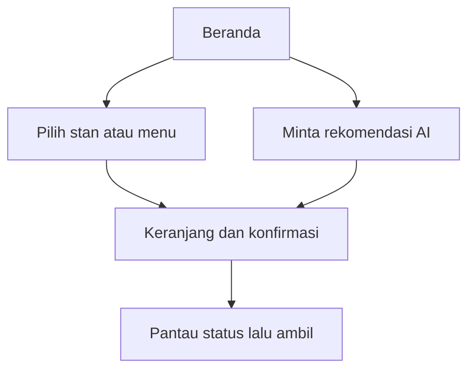
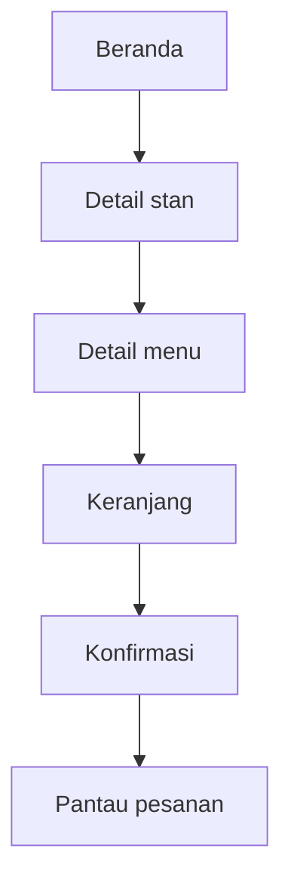
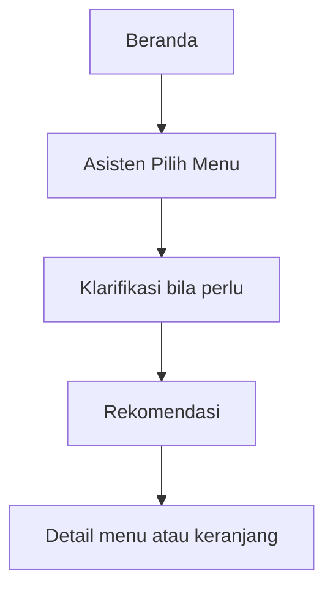
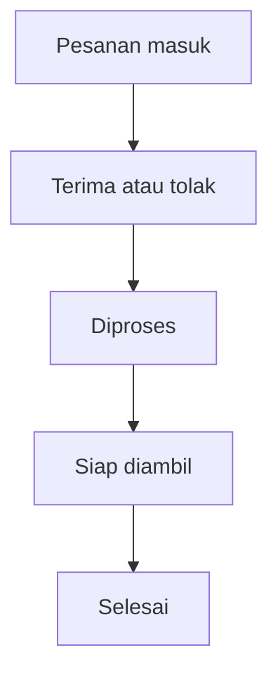

# KantinCerdas — UI Blueprint dan Design System

**Arah visual:** Kantin Hangat  
**Versi dokumen:** 1.0  
**Platform:** Android, implementasi Flutter  
**Ukuran acuan desain:** 390 × 844 dp  
**Mode tahap awal:** Dummy data / fake repository

---

## 1. Gambaran Sederhana Aplikasi

KantinCerdas membantu mahasiswa **memilih makanan, memesan sebelum tiba di kantin, memantau status, lalu mengambil dan membayar di konter**.



Hal yang sengaja tidak ditampilkan di UI versi awal:

- alamat pengantaran, kurir, peta, dan GPS;
- promo, voucher, rating, atau ulasan;
- pembayaran digital;
- jadwal pesanan untuk hari lain;
- banyak kampus atau UMKM umum.

---

## 2. Karakter Desain

Tiga kata utama: **hangat, cepat, dan dekat**.

- **Hangat:** warna oranye-krem dan foto makanan Indonesia membuat aplikasi terasa seperti kantin yang akrab.
- **Cepat:** informasi harga, ketersediaan, dan estimasi penyajian mudah dipindai.
- **Dekat:** bahasa sederhana, nama stan yang familiar, dan tidak memakai istilah teknis.
- **Cerdas tanpa berlebihan:** AI menjadi jalan pintas memilih menu, bukan chatbot yang mendominasi semua halaman.

Referensi pola interaksi:

- [Material Design 3 Search](https://m3.material.io/components/search/guidelines)
- [Material Design 3 Chips](https://m3.material.io/components/chips/guidelines)
- [Material Design 3 Navigation Bar](https://m3.material.io/components/navigation-bar)
- [Campus Crave](https://dribbble.com/shots/27080483-Campus-Food-Ordering-Canteen-Management-App-Campus-Crave)
- [Eato.AI](https://dribbble.com/shots/26870260-Eato-AI-AI-Food-Recommendation-Animation)

Referensi tersebut digunakan sebagai inspirasi pola, bukan untuk disalin secara visual.

---

## 3. Warna

### 3.1 Warna merek dan permukaan

| Token | Nilai | Penggunaan |
|---|---|---|
| `brandOrange` | `#E85D2A` | Logo, ilustrasi, highlight besar, ikon dekoratif |
| `actionOrange` | `#C74418` | Tombol utama dan teks aksi pada latar terang |
| `darkTerracotta` | `#9B341B` | Judul berwarna, ikon aktif, keadaan pressed |
| `goldAccent` | `#F4B740` | Aksen kecil dan perhatian non-kritis |
| `backgroundWarm` | `#FFF8EF` | Latar utama aplikasi |
| `surface` | `#FFFFFF` | Kartu, dialog, bottom sheet, input |
| `surfaceWarm` | `#FDEDE2` | Panel AI, kategori, dan section alternatif |
| `outline` | `#D8C6BA` | Border input dan divider |
| `textPrimary` | `#251B17` | Judul dan isi utama |
| `textSecondary` | `#6D5A50` | Metadata dan keterangan |
| `disabled` | `#A99A92` | Teks/ikon nonaktif |

`brandOrange` dipertahankan sebagai identitas visual. Untuk teks kecil dan tombol, gunakan `actionOrange` karena kontrasnya lebih aman pada latar putih/krem.

### 3.2 Warna status

| Status | Warna utama | Container | Contoh label |
|---|---|---|---|
| Tersedia / buka | `#2E7D32` | `#E7F5E8` | Buka, Tersedia |
| Menunggu | `#9A6700` | `#FFF1C2` | Menunggu konfirmasi |
| Diproses | `#A54B00` | `#FFE7CC` | Sedang diproses |
| Siap diambil | `#167A56` | `#DDF5EA` | Siap diambil |
| Selesai | `#475569` | `#EEF2F6` | Selesai |
| Ditolak / error | `#B3261E` | `#FCE8E6` | Ditolak, Gagal |

Warna tidak boleh menjadi satu-satunya penanda. Selalu sertakan teks status dan ikon yang sesuai.

### 3.3 Contoh `ColorScheme` Flutter

```dart
const kantinCerdasColorScheme = ColorScheme.light(
  primary: Color(0xFFC74418),
  onPrimary: Color(0xFFFFFFFF),
  primaryContainer: Color(0xFFFDEDE2),
  onPrimaryContainer: Color(0xFF3B1205),
  secondary: Color(0xFFF4B740),
  onSecondary: Color(0xFF251B17),
  surface: Color(0xFFFFFFFF),
  onSurface: Color(0xFF251B17),
  error: Color(0xFFB3261E),
  onError: Color(0xFFFFFFFF),
  outline: Color(0xFFD8C6BA),
);
```

---

## 4. Tipografi

Gunakan **Plus Jakarta Sans**. Fallback: `Inter`, lalu sans-serif bawaan sistem.

| Style | Ukuran / tinggi baris | Weight | Penggunaan |
|---|---:|---:|---|
| Display | 32 / 40 | 700 | Headline utama beranda |
| Heading 1 | 28 / 36 | 700 | Judul halaman |
| Heading 2 | 22 / 28 | 700 | Judul section besar |
| Title | 18 / 24 | 700 | Nama menu, stan, dan dialog |
| Body Large | 16 / 24 | 400 | Isi utama dan input |
| Body Medium | 14 / 20 | 400 | Metadata dan deskripsi |
| Label Large | 14 / 20 | 600 | Tombol, tab, dan chip |
| Caption | 12 / 16 | 500 | Catatan sekunder |

Aturan:

- Maksimal dua weight dominan dalam satu layar: 400 dan 700.
- Harga boleh memakai weight 700 dan `actionOrange`.
- Hindari teks isi di bawah 12 sp.
- Gunakan sentence case: “Siap diambil”, bukan “SIAP DIAMBIL”.

---

## 5. Spacing, Ukuran, dan Bentuk

### 5.1 Spacing

| Token | Nilai | Contoh penggunaan |
|---|---:|---|
| `space1` | 4 | Jarak ikon dengan label kecil |
| `space2` | 8 | Jarak elemen dalam grup |
| `space3` | 12 | Padding chip dan metadata |
| `space4` | 16 | Padding halaman dan kartu |
| `space5` | 24 | Jarak antar-section |
| `space6` | 32 | Pemisah blok utama |
| `space7` | 40 | Ruang hero |
| `space8` | 48 | Tinggi minimum target sentuh |

### 5.2 Radius

| Token | Nilai | Penggunaan |
|---|---:|---|
| `radiusSmall` | 8 | Status badge dan elemen kecil |
| `radiusMedium` | 12 | Input dan list tile |
| `radiusLarge` | 20 | Kartu menu dan panel AI |
| `radiusXLarge` | 24 | Bottom sheet dan hero surface |
| `radiusPill` | 999 | Chip dan tombol pill |

### 5.3 Ukuran komponen

- Padding horizontal halaman: **16 dp**.
- Tombol utama: tinggi **48–52 dp**.
- Search field: tinggi **52–56 dp**.
- Filter chip: tinggi **36–40 dp**.
- Bottom navigation: tinggi sekitar **72–80 dp**.
- Target sentuh minimum: **48 × 48 dp**.
- Foto menu list: **88 × 88 dp**, radius 12 dp.
- Foto kartu horizontal: rasio **4:3**.

Gunakan shadow dengan hemat. Prioritas pemisah: spacing → divider → warna surface → border → shadow.

---

## 6. Ikon dan Foto

### Ikon

- Gunakan **Material Symbols Rounded** agar cocok dengan bentuk UI yang ramah.
- Ukuran standar 20, 24, dan 28 dp.
- Ikon harus ditemani label jika maknanya tidak langsung jelas.
- Jangan menggunakan emoji sebagai ikon antarmuka.

### Foto makanan

- Gunakan foto makanan Indonesia yang natural dan realistis.
- Cahaya hangat, makanan terlihat jelas, tanpa logo merek.
- Crop konsisten; jangan meregangkan gambar.
- Jangan menaruh teks di dalam foto.
- Sediakan fallback image jika foto gagal dimuat.

---

## 7. Komponen Inti

### 7.1 Tombol

| Jenis | Tampilan | Penggunaan |
|---|---|---|
| Primary | `actionOrange`, teks putih | Pesan sekarang, Konfirmasi, Tanya AI |
| Secondary | `surface`, border `actionOrange` | Lihat detail, Coba lagi |
| Tertiary | Teks `actionOrange` tanpa container | Lihat semua, Batalkan |
| Destructive | Merah atau dialog konfirmasi | Tolak pesanan, Kosongkan keranjang |

Semua tombol memiliki state default, pressed, focused, loading, dan disabled.

### 7.2 Search field

- Placeholder: **“Cari menu atau stan”**.
- Ikon pencarian di kiri; tombol hapus muncul ketika ada input.
- Search berjalan dari beranda dan halaman stan.
- Hasil kosong harus menawarkan reset filter.

### 7.3 Filter chip

- Contoh: Semua, Nasi, Mi, Camilan, Minuman.
- Selected: container oranye muda, teks terracotta.
- Unselected: surface putih dengan outline tipis.
- Jangan memuat lebih dari satu baris tetap; gunakan horizontal scroll.

### 7.4 Panel Asisten Pilih Menu

- Judul ramah: **“Masih bingung?”** atau **“Bantu pilih menu”**.
- Keterangan singkat tentang budget, rasa, dan waktu.
- Satu CTA: **“Coba asisten”**.
- Tidak menjadi pop-up otomatis.
- Pada halaman AI, gunakan suggestion chip seperti “Di bawah Rp20.000” dan “Tidak pedas”.

### 7.5 Kartu menu

Informasi wajib:

1. foto makanan;
2. nama menu;
3. harga;
4. nama stan;
5. estimasi penyajian;
6. status tersedia/habis.

Informasi yang tidak diperlukan: rating, jarak kilometer, ongkir, voucher, dan diskon.

### 7.6 Status pesanan

Gunakan timeline vertikal:

```text
Menunggu konfirmasi → Diproses → Siap diambil → Selesai
                    ↘ Ditolak
```

Status aktif memakai warna dan ikon; status berikutnya memakai abu-abu. Untuk “Siap diambil”, tampilkan nomor pesanan dan instruksi bayar di konter secara menonjol.

### 7.7 Bottom navigation

Mahasiswa memiliki tiga tujuan utama:

- **Beranda**
- **Pesanan**
- **Profil**

Keranjang bukan tab permanen. Saat berisi item, tampilkan sticky cart bar di atas bottom navigation.

Pengelola memiliki empat tujuan:

- **Dashboard**
- **Pesanan**
- **Menu**
- **Profil**

---

## 8. Peta Layar

### 8.1 Mahasiswa

| Layar | Tujuan utama | CTA utama |
|---|---|---|
| Beranda | Menemukan menu/stan dengan cepat | Cari atau pilih menu |
| Hasil pencarian/filter | Mempersempit pilihan | Buka detail |
| Detail stan | Melihat menu pada satu stan | Pilih menu |
| Detail menu | Memastikan harga dan ketersediaan | Tambah ke keranjang |
| Asisten Pilih Menu | Menjelaskan kebutuhan | Tanya AI |
| Hasil rekomendasi | Membandingkan maksimal lima menu | Buka detail / tambah |
| Keranjang | Mengubah jumlah dan memeriksa total | Lanjutkan |
| Konfirmasi | Memastikan pesanan dan bayar di konter | Buat pesanan |
| Pesanan berhasil | Menampilkan nomor pesanan | Pantau pesanan |
| Detail pesanan | Memantau status hingga siap | Tunjukkan nomor pesanan |
| Profil | Informasi akun dan mode demo | Keluar |

### 8.2 Pengelola stan

| Layar | Tujuan utama | CTA utama |
|---|---|---|
| Dashboard | Melihat kondisi stan dan ringkasan antrean | Buka pesanan |
| Pesanan masuk | Memilah pesanan berdasarkan status | Buka detail |
| Detail pesanan | Menerima, menolak, dan memperbarui status | Aksi status berikutnya |
| Daftar menu | Mengatur menu tersedia/habis | Ubah ketersediaan |
| Pengaturan stan | Mengubah buka/tutup dan estimasi | Simpan perubahan |
| Profil | Informasi pengelola | Keluar |

---

## 9. Alur Utama

### Mahasiswa — memilih sendiri



### Mahasiswa — dibantu AI



### Pengelola



---

## 10. State yang Wajib Didesain

Setiap layar berbasis data harus mempunyai:

- **loading:** skeleton sesuai bentuk konten;
- **empty:** alasan singkat dan satu tindakan yang relevan;
- **error:** pesan manusiawi dan tombol Coba lagi;
- **success:** data normal;
- **offline/demo:** penanda kecil jika diperlukan, tanpa menutupi alur utama;
- **disabled:** alasan mengapa aksi tidak bisa digunakan.

Contoh teks:

- Tidak ada hasil: “Belum ada menu yang cocok. Coba ubah filter.”
- Stan tutup: “Stan sedang tutup. Kamu masih bisa melihat menunya.”
- Menu habis: “Menu ini sedang habis.”
- AI gagal: “Asisten sedang bermasalah. Kamu tetap bisa mencari secara manual.”
- Izin notifikasi ditolak: “Status pesanan tetap bisa dilihat di halaman Pesanan.”

---

## 11. Aksesibilitas dan Responsivitas

- Kontras teks normal minimal setara 4.5:1.
- Tombol dan ikon interaktif minimal 48 × 48 dp.
- Jangan mengandalkan warna saja untuk status.
- Semua gambar makanan memiliki semantic label.
- UI harus tetap terbaca ketika text scale dinaikkan.
- Gunakan `SafeArea` dan hindari elemen penting tertutup keyboard.
- Uji minimal pada lebar 360 dp, 390 dp, dan 412 dp.
- Harga dan total tidak boleh terpotong pada text scale besar.
- Navigasi dan urutan fokus harus logis.

---

## 12. Hubungan Desain dengan Versi UI

| Versi | Layar/komponen yang didesain dan dikerjakan |
|---|---|
| `v0.1.0-alpha.1` | Fondasi proyek dan dokumentasi desain |
| `v0.2.0-alpha.1` | Theme, token, tombol, input, state, app shell, bottom navigation |
| `v0.3.0-alpha.1` | Beranda, pencarian/filter, detail stan, detail menu |
| `v0.4.0-alpha.1` | Panel AI, halaman asisten, klarifikasi, rekomendasi, fallback |
| `v0.5.0-alpha.1` | Keranjang, konfirmasi, sukses, detail/status pesanan |
| `v0.6.0-alpha.1` | Dashboard, pesanan, menu, dan pengaturan stan pengelola |
| `v0.7.0-beta.1` | Permission notifikasi, deep link, polish, dan state demo lengkap |

---

## 13. Aturan Konsistensi untuk Tim

- Jangan membuat warna baru langsung di widget.
- Jangan membuat ukuran radius/spacing baru tanpa alasan yang dicatat.
- Gunakan komponen bersama untuk tombol, field, chip, kartu, dan status.
- Jangan menaruh dummy data langsung di widget.
- Setiap layar baru harus menunjukkan loading, empty, error, dan success jika relevan.
- Setiap pull request UI menyertakan screenshot sebelum/sesudah atau hasil akhir.
- Desain baru yang menambah fitur di luar Mini-SRS harus ditunda ke backlog.

---

## 14. Urutan Desain dan Implementasi

1. Buat theme dan seluruh token.
2. Bangun komponen dasar.
3. Selesaikan app shell dan navigasi.
4. Bangun beranda dan katalog sebagai visual baseline.
5. Gunakan baseline yang sama untuk AI dan pemesanan.
6. Turunkan komponen yang sama ke UI pengelola.
7. Tambahkan seluruh state dan lakukan accessibility check.
8. Bekukan UI pada `v0.7.0-beta.1` sebelum integrasi backend.

Dokumen ini menjadi sumber kebenaran visual. Jika mockup dan implementasi berbeda, tim harus memperbarui dokumen atau memperbaiki implementasi—jangan membiarkan keduanya berjalan dengan aturan berbeda.
