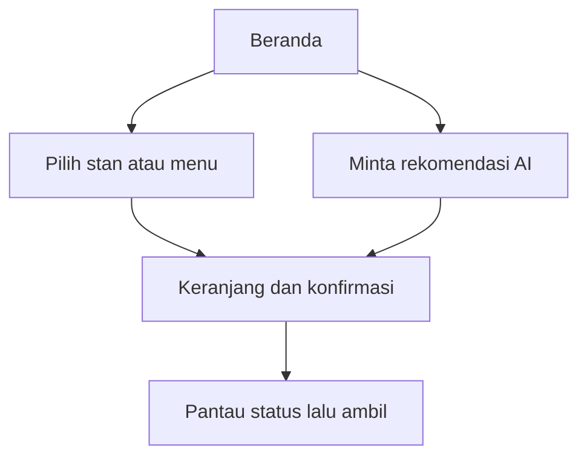
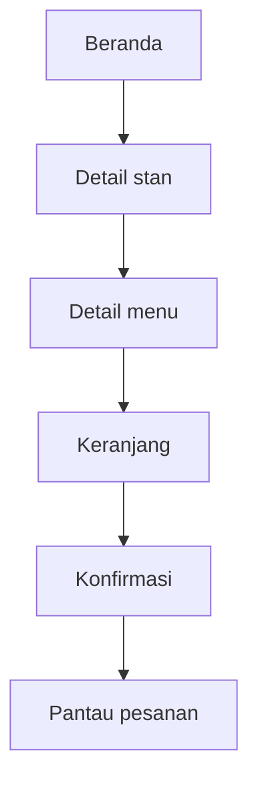
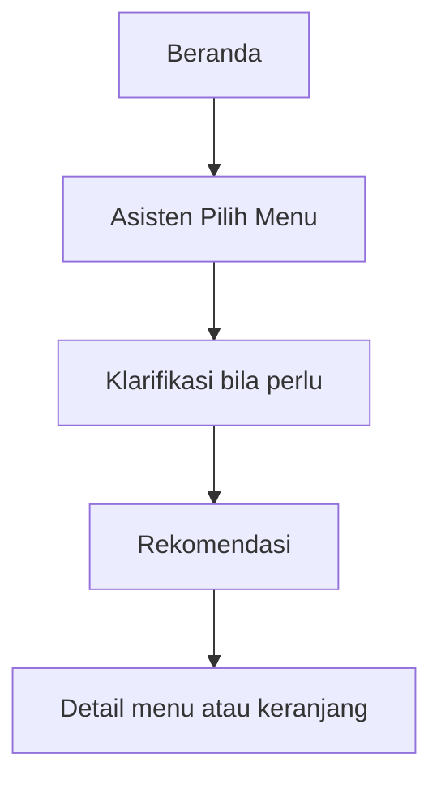
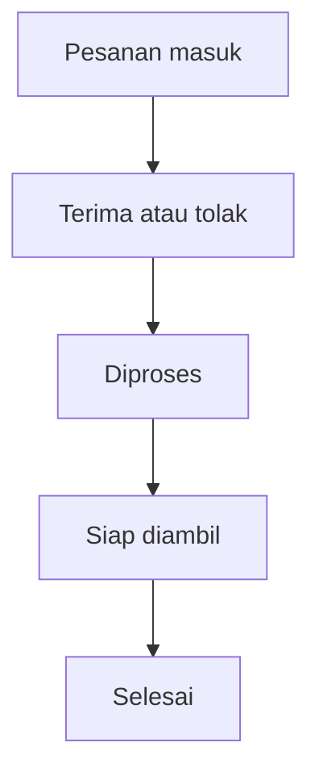

# KantinCerdas — UI Blueprint dan Design System

**Arah visual:** Kantin Kampus Praktis  
**Versi dokumen:** 2.0  
**Status:** Arah visual terkunci  
**Pembaruan:** 4 September 2026  
**Platform:** Android, implementasi Flutter  
**Ukuran acuan desain:** 390 × 844 dp  
**Mode tahap awal:** Dummy data / fake repository

---

## 1. Gambaran Sederhana Aplikasi

KantinCerdas membantu mahasiswa **memilih makanan, memesan sebelum tiba di kantin, memantau status, lalu mengambil dan membayar di konter**.



Hal yang sengaja tidak ditampilkan di UI versi awal:

- alamat pengantaran, kurir, peta, dan GPS;
- promo, voucher, rating, atau ulasan;
- pembayaran digital;
- jadwal pesanan untuk hari lain;
- banyak kampus atau UMKM umum.

---

## 2. Karakter Desain

Tiga kata utama: **praktis, hangat, dan dekat**.

- **Praktis:** harga, ketersediaan, waktu penyajian, dan tindakan utama terbaca dalam sekali pindai.
- **Hangat:** identitas oranye dan foto makanan Indonesia tetap memberi rasa akrab tanpa mewarnai seluruh layar.
- **Dekat:** bahasa sederhana, nama stan yang familiar, dan konteks kampus terasa nyata.
- **Cerdas tanpa mendominasi:** AI hadir sebagai bantuan opsional melalui tombol mengambang, bukan sebagai maskot atau pusat setiap halaman.

Prinsip visual yang dikunci:

- konten dan tindakan lebih penting daripada dekorasi;
- permukaan utama putih atau netral hangat, sedangkan oranye hanya menandai merek, aksi utama, dan state aktif;
- gunakan spacing dan divider untuk mengelompokkan konten sebelum memakai kartu, border, atau shadow;
- gunakan daftar ringkas untuk menu dan pesanan; jangan membuat setiap baris menjadi kartu tersendiri;
- hindari ciri visual generik hasil AI seperti gradien, glow, ilustrasi robot besar, kartu bertumpuk, pill berlebihan, dan slogan dekoratif.

Referensi pola interaksi:

- [Material Design 3 Search](https://m3.material.io/components/search/guidelines)
- [Material Design 3 Chips](https://m3.material.io/components/chips/guidelines)
- [Material Design 3 Navigation Bar](https://m3.material.io/components/navigation-bar)
- [Material Design 3 Floating Action Button](https://m3.material.io/components/floating-action-button/guidelines)
- [Material Design 3 Bottom Sheets](https://m3.material.io/components/bottom-sheets/guidelines)

Referensi tersebut digunakan sebagai inspirasi pola, bukan untuk disalin secara visual.

---

## 3. Warna

### 3.1 Warna merek dan permukaan

| Token | Nilai | Penggunaan |
|---|---|---|
| `brandOrange` | `#E85D2A` | Wordmark dan identitas merek |
| `actionOrange` | `#C74418` | Tombol utama dan teks aksi pada latar terang |
| `darkTerracotta` | `#9B341B` | Judul berwarna, ikon aktif, keadaan pressed |
| `goldAccent` | `#F4B740` | Aksen kecil dan perhatian non-kritis |
| `backgroundWarm` | `#FAFAF8` | Latar utama aplikasi |
| `surface` | `#FFFFFF` | Kartu, dialog, bottom sheet, input |
| `surfaceWarm` | `#F7F3F0` | Section alternatif yang benar-benar memerlukan pemisah |
| `outline` | `#DDD6D1` | Border input dan divider |
| `textPrimary` | `#251B17` | Judul dan isi utama |
| `textSecondary` | `#6D5A50` | Metadata dan keterangan |
| `disabled` | `#A99A92` | Teks/ikon nonaktif |

`brandOrange` dipertahankan sebagai identitas visual. Jangan memakai oranye sebagai wash pada seluruh latar. Untuk teks kecil dan tombol, gunakan `actionOrange` karena kontrasnya lebih aman pada latar putih atau netral.

### 3.2 Warna status

| Status | Warna utama | Container | Contoh label |
|---|---|---|---|
| Tersedia / buka | `#2E7D32` | `#E7F5E8` | Buka, Tersedia |
| Menunggu | `#9A6700` | `#FFF1C2` | Menunggu konfirmasi |
| Diproses | `#A54B00` | `#FFE7CC` | Sedang diproses |
| Siap diambil | `#167A56` | `#DDF5EA` | Siap diambil |
| Selesai | `#475569` | `#EEF2F6` | Selesai |
| Ditolak / error | `#B3261E` | `#FCE8E6` | Ditolak, Gagal |

Warna tidak boleh menjadi satu-satunya penanda. Selalu sertakan teks status dan ikon yang sesuai.

### 3.3 Contoh `ColorScheme` Flutter

```dart
const kantinCerdasColorScheme = ColorScheme.light(
  primary: Color(0xFFC74418),
  onPrimary: Color(0xFFFFFFFF),
  primaryContainer: Color(0xFFFBE9E2),
  onPrimaryContainer: Color(0xFF3B1205),
  secondary: Color(0xFFF4B740),
  onSecondary: Color(0xFF251B17),
  surface: Color(0xFFFFFFFF),
  onSurface: Color(0xFF251B17),
  error: Color(0xFFB3261E),
  onError: Color(0xFFFFFFFF),
  outline: Color(0xFFDDD6D1),
);
```

---

## 4. Tipografi

Gunakan **Plus Jakarta Sans**. Fallback: `Inter`, lalu sans-serif bawaan sistem.

| Style | Ukuran / tinggi baris | Weight | Penggunaan |
|---|---:|---:|---|
| Display | 28 / 36 | 700 | Headline khusus jika benar-benar dibutuhkan |
| Heading 1 | 24 / 32 | 700 | Judul halaman |
| Heading 2 | 20 / 28 | 700 | Judul section besar |
| Title | 18 / 24 | 700 | Nama menu, stan, dan dialog |
| Body Large | 16 / 24 | 400 | Isi utama dan input |
| Body Medium | 14 / 20 | 400 | Metadata dan deskripsi |
| Label Large | 14 / 20 | 600 | Tombol, tab, dan chip |
| Caption | 12 / 16 | 500 | Catatan sekunder |

Aturan:

- Maksimal dua weight dominan dalam satu layar: 400 dan 700.
- Harga boleh memakai weight 700 dan `actionOrange`.
- Hindari teks isi di bawah 12 sp.
- Gunakan sentence case: “Siap diambil”, bukan “SIAP DIAMBIL”.

---

## 5. Spacing, Ukuran, dan Bentuk

### 5.1 Spacing

| Token | Nilai | Contoh penggunaan |
|---|---:|---|
| `space1` | 4 | Jarak ikon dengan label kecil |
| `space2` | 8 | Jarak elemen dalam grup |
| `space3` | 12 | Padding chip dan metadata |
| `space4` | 16 | Padding halaman dan kartu |
| `space5` | 24 | Jarak antar-section |
| `space6` | 32 | Pemisah blok utama |
| `space7` | 40 | Ruang hero |
| `space8` | 48 | Tinggi minimum target sentuh |

### 5.2 Radius

| Token | Nilai | Penggunaan |
|---|---:|---|
| `radiusSmall` | 8 | Status badge dan elemen kecil |
| `radiusMedium` | 12 | Input, thumbnail, dan container kecil |
| `radiusLarge` | 16 | Container mandiri yang benar-benar memerlukan batas |
| `radiusXLarge` | 24 | Sudut atas modal bottom sheet |
| `radiusPill` | 999 | Chip, status kecil, dan floating button berbentuk lingkaran |

### 5.3 Ukuran komponen

- Padding horizontal halaman: **16 dp**.
- Tombol utama: tinggi **48–52 dp**.
- Search field: tinggi **52–56 dp**.
- Filter chip: tinggi **36–40 dp**.
- Bottom navigation: tinggi sekitar **72–80 dp**.
- Target sentuh minimum: **48 × 48 dp**.
- Foto menu list: **88 × 88 dp**, radius 12 dp.
- Floating assistant button: **56 × 56 dp**.
- Coachmark asisten: lebar sekitar **190–215 dp**, tinggi **72–84 dp**.
- Bottom sheet asisten: menyesuaikan konten, maksimal sekitar **85%** tinggi layar.

Gunakan shadow dengan hemat. Prioritas pemisah: spacing → divider → warna surface → border → shadow. Floating assistant tidak boleh menutupi harga, tombol `Tambah`, sticky cart, atau bottom navigation.

---

## 6. Ikon dan Foto

### Ikon

- Gunakan **Material Symbols Rounded** agar cocok dengan bentuk UI yang ramah.
- Ukuran standar 20, 24, dan 28 dp.
- Ikon harus ditemani label jika maknanya tidak langsung jelas.
- Jangan menggunakan emoji sebagai ikon antarmuka.

### Foto makanan

- Gunakan foto makanan Indonesia yang natural dan realistis.
- Cahaya hangat, makanan terlihat jelas, tanpa logo merek.
- Crop konsisten; jangan meregangkan gambar.
- Jangan menaruh teks di dalam foto.
- Sediakan fallback image jika foto gagal dimuat.

---

## 7. Komponen Inti

### 7.1 Tombol

| Jenis | Tampilan | Penggunaan |
|---|---|---|
| Primary | `actionOrange`, teks putih | Tambah, Buat pesanan, Cari rekomendasi, Terima pesanan |
| Secondary | `surface`, border `actionOrange` | Lihat detail, Coba lagi |
| Tertiary | Teks `actionOrange` tanpa container | Lihat semua, Batalkan |
| Destructive | Merah atau dialog konfirmasi | Tolak pesanan, Kosongkan keranjang |

Semua tombol memiliki state default, pressed, focused, loading, dan disabled.

### 7.2 Search field

- Placeholder: **“Cari menu atau stan”**.
- Ikon pencarian di kiri; tombol hapus muncul ketika ada input.
- Search berjalan dari beranda dan halaman stan.
- Hasil kosong harus menawarkan reset filter.

### 7.3 Filter chip

- Contoh: Semua, Nasi, Mi, Camilan, Minuman.
- Selected: container oranye muda, teks terracotta.
- Unselected: surface putih dengan outline tipis.
- Jangan memuat lebih dari satu baris tetap; gunakan horizontal scroll.

### 7.4 Floating Asisten Pilih Menu

Asisten memakai satu logo sederhana berupa gabungan speech bubble, alat makan, dan sparkle kecil. Jangan menggunakan ilustrasi robot atau karakter maskot penuh.

**State diam**

- tombol bulat **56 × 56 dp** di kanan bawah;
- jarak kanan **16 dp** dan jarak bawah **12–16 dp** dari bottom navigation atau sticky cart;
- semantic label: **“Buka asisten pilih menu”**;
- ditampilkan hanya di Beranda dan Detail Stan.

**Pengenalan pertama kali**

- tunggu konten utama stabil sekitar **800 ms**;
- animasi satu kali: scale `1.00 → 1.06 → 1.00` selama sekitar **240 ms**;
- tampilkan coachmark dengan judul **“Bingung pilih?”** dan isi **“Aku bantu cari menu.”**;
- coachmark bisa diketuk untuk membuka asisten dan mempunyai tombol tutup dengan target sentuh 48 dp;
- setelah ditutup atau digunakan, simpan state lokal agar tidak muncul lagi pada setiap kunjungan;
- jangan menjalankan animasi berulang, bouncing, atau pengingat berdasarkan timer acak.

**Pengingat kontekstual**

- hanya saat ada kebutuhan nyata, misalnya pencarian tidak menemukan hasil atau pengguna beberapa kali mengubah filter tanpa memilih;
- maksimal satu pengingat per sesi;
- tidak muncul di Keranjang, Konfirmasi, Status Pesanan, maupun seluruh sisi pengelola.

**State dibuka**

- gunakan modal bottom sheet dengan judul **“Bantu pilih menu”**;
- tampilkan pilihan cepat seperti **“Di bawah Rp20.000”**, **“Cepat jadi”**, **“Tidak pedas”**, dan **“Pakai nasi”**;
- sediakan field **“Tulis pilihan lain…”** dan satu CTA **“Cari rekomendasi”**;
- jangan langsung menampilkan percakapan kosong; mulai dari kebutuhan pengguna agar beban berpikir lebih rendah;
- jika asisten gagal, pengguna tetap dapat mencari dan memilih menu secara manual.

### 7.5 Baris menu

Informasi wajib:

1. foto makanan;
2. nama menu;
3. harga;
4. nama stan;
5. estimasi penyajian;
6. status tersedia/habis.

Gunakan satu grouped list dengan divider tipis. Jangan membungkus setiap baris menu dalam kartu terpisah. Tombol `Tambah` sejajar konsisten dan tidak boleh tertutup elemen floating.

Informasi yang tidak diperlukan: rating, jarak kilometer, ongkir, voucher, dan diskon.

### 7.6 Status pesanan

Gunakan timeline vertikal:

```text
Menunggu konfirmasi → Diproses → Siap diambil → Selesai
                    ↘ Ditolak
```

Status aktif memakai warna dan ikon; status berikutnya memakai abu-abu. Untuk “Siap diambil”, tampilkan nomor pesanan dan instruksi bayar di konter secara menonjol.

### 7.7 Bottom navigation

Mahasiswa memiliki tiga tujuan utama:

- **Beranda**
- **Pesanan**
- **Profil**

Keranjang bukan tab permanen. Saat berisi item, tampilkan sticky cart bar di atas bottom navigation.

Floating assistant ikut bergeser ke atas saat sticky cart muncul. Pada alur checkout dan pemantauan pesanan, floating assistant disembunyikan sepenuhnya.

Pengelola memiliki empat tujuan:

- **Dashboard**
- **Pesanan**
- **Menu**
- **Profil**

---

## 8. Peta Layar

### 8.1 Mahasiswa

| Layar | Tujuan utama | CTA utama |
|---|---|---|
| Beranda | Menemukan menu/stan dengan cepat | Cari atau pilih menu |
| Hasil pencarian/filter | Mempersempit pilihan | Buka detail |
| Detail stan | Melihat menu pada satu stan | Pilih menu |
| Detail menu | Memastikan harga dan ketersediaan | Tambah ke keranjang |
| Asisten Pilih Menu | Menentukan budget, rasa, dan waktu melalui bottom sheet | Cari rekomendasi |
| Hasil rekomendasi | Membandingkan maksimal lima menu dalam bottom sheet atau layar lanjutan | Buka detail / tambah |
| Keranjang | Mengubah jumlah dan memeriksa total | Lanjutkan |
| Konfirmasi | Memastikan pesanan dan bayar di konter | Buat pesanan |
| Pesanan berhasil | Menampilkan nomor pesanan | Pantau pesanan |
| Detail pesanan | Memantau status hingga siap | Tunjukkan nomor pesanan |
| Profil dan preferensi makanan | Informasi akun, mode demo, serta preferensi bantuan memilih menu | Simpan preferensi / Keluar |

### 8.2 Pengelola stan

| Layar | Tujuan utama | CTA utama |
|---|---|---|
| Dashboard | Melihat kondisi stan dan ringkasan antrean | Buka pesanan |
| Pesanan masuk | Memilah pesanan berdasarkan status | Buka detail |
| Detail pesanan | Menerima, menolak, dan memperbarui status | Aksi status berikutnya |
| Daftar menu | Mengatur menu tersedia/habis | Ubah ketersediaan |
| Pengaturan stan | Mengubah buka/tutup dan estimasi | Simpan perubahan |
| Profil | Informasi pengelola | Keluar |

Mockup menjelaskan hierarki dan perilaku, bukan menambah kebutuhan fungsional secara otomatis. Aksi seperti membatalkan pesanan atau menambah/edit/hapus menu hanya boleh diaktifkan setelah aturan bisnisnya ditetapkan pada Mini-SRS.

---

## 9. Alur Utama

### Mahasiswa — memilih sendiri



### Mahasiswa — dibantu AI



### Pengelola



---

## 10. State yang Wajib Didesain

Setiap layar berbasis data harus mempunyai:

- **loading:** skeleton sesuai bentuk konten;
- **empty:** alasan singkat dan satu tindakan yang relevan;
- **error:** pesan manusiawi dan tombol Coba lagi;
- **success:** data normal;
- **offline/demo:** penanda kecil jika diperlukan, tanpa menutupi alur utama;
- **disabled:** alasan mengapa aksi tidak bisa digunakan.
- **first visit:** coachmark asisten satu kali, dapat ditutup, dan tidak menutupi aksi utama;
- **returning visit:** hanya logo asisten dalam state diam;

Contoh teks:

- Tidak ada hasil: “Belum ada menu yang cocok. Coba ubah filter.”
- Stan tutup: “Stan sedang tutup. Kamu masih bisa melihat menunya.”
- Menu habis: “Menu ini sedang habis.”
- AI gagal: “Asisten sedang bermasalah. Kamu tetap bisa mencari secara manual.”
- Izin notifikasi ditolak: “Status pesanan tetap bisa dilihat di halaman Pesanan.”

---

## 11. Aksesibilitas dan Responsivitas

- Kontras teks normal minimal setara 4.5:1.
- Tombol dan ikon interaktif minimal 48 × 48 dp.
- Jangan mengandalkan warna saja untuk status.
- Semua gambar makanan memiliki semantic label.
- UI harus tetap terbaca ketika text scale dinaikkan.
- Gunakan `SafeArea` dan hindari elemen penting tertutup keyboard.
- Uji minimal pada lebar 360 dp, 390 dp, dan 412 dp.
- Harga dan total tidak boleh terpotong pada text scale besar.
- Navigasi dan urutan fokus harus logis.
- Hormati `MediaQuery.disableAnimations` atau preferensi reduced motion; lewati animasi scale bila aktif.
- Coachmark dan bottom sheet harus memindahkan serta mengembalikan fokus secara logis.
- Tombol ikon wajib mempunyai tooltip atau semantic label yang menjelaskan hasil tindakannya.
- Uji posisi floating assistant ketika keyboard, sticky cart, dan text scale besar aktif.

---

## 12. Hubungan Desain dengan Versi UI

| Versi | Layar/komponen yang didesain dan dikerjakan |
|---|---|
| `v0.1.0-alpha.1` | Fondasi proyek dan dokumentasi desain |
| `v0.2.0-alpha.1` | Theme, token, tombol, input, state, app shell, bottom navigation |
| `v0.3.0-alpha.1` | Beranda, pencarian/filter, detail stan, detail menu |
| `v0.4.0-alpha.1` | Floating assistant, coachmark satu kali, bottom sheet, rekomendasi, dan fallback |
| `v0.5.0-alpha.1` | Keranjang, konfirmasi, sukses, detail/status pesanan |
| `v0.6.0-alpha.1` | Dashboard, pesanan, menu, dan pengaturan stan pengelola |
| `v0.7.0-beta.1` | Permission notifikasi, deep link, polish, dan state demo lengkap |

---

## 13. Aturan Konsistensi untuk Tim

- Jangan membuat warna baru langsung di widget.
- Jangan membuat ukuran radius/spacing baru tanpa alasan yang dicatat.
- Gunakan komponen bersama untuk tombol, field, chip, baris menu, coachmark, bottom sheet, dan status.
- Gunakan kartu hanya untuk objek yang benar-benar mandiri; daftar biasa memakai spacing dan divider.
- Jangan menambahkan maskot robot, banner AI, gradien, atau warna oranye baru tanpa keputusan desain bersama.
- Oranye tidak boleh menjadi satu-satunya cara membedakan aksi atau status.
- Jangan menaruh dummy data langsung di widget.
- Setiap layar baru harus menunjukkan loading, empty, error, dan success jika relevan.
- Setiap pull request UI menyertakan screenshot sebelum/sesudah atau hasil akhir.
- Desain baru yang menambah fitur di luar Mini-SRS harus ditunda ke backlog.

---

## 14. Urutan Desain dan Implementasi

1. Buat theme dan seluruh token.
2. Bangun komponen dasar.
3. Selesaikan app shell dan navigasi.
4. Bangun beranda dan katalog sebagai visual baseline yang terkunci.
5. Bangun floating assistant, coachmark, dan bottom sheet dari primitive yang sama.
6. Turunkan komponen yang sama ke UI pengelola.
7. Tambahkan seluruh state dan lakukan accessibility check.
8. Bekukan UI pada `v0.7.0-beta.1` sebelum integrasi backend.

Dokumen ini menjadi sumber kebenaran visual. Jika mockup dan implementasi berbeda, tim harus memperbarui dokumen atau memperbaiki implementasi—jangan membiarkan keduanya berjalan dengan aturan berbeda.

---

## 15. Handoff Implementasi Flutter

Gunakan komponen Flutter bawaan atau primitive proyek sebelum menambah dependency UI baru:

- `Scaffold` dan `SafeArea` untuk shell layar;
- `NavigationBar` untuk navigasi utama;
- `ListView.separated` atau sliver setara untuk daftar menu dan pesanan;
- `FloatingActionButton` untuk logo asisten dalam state diam;
- `OverlayEntry` atau widget overlay yang terkontrol untuk coachmark;
- `showModalBottomSheet` dengan `isScrollControlled: true` untuk state asisten dibuka;
- `Semantics`, `Tooltip`, dan focus handling untuk tombol ikon dan perubahan state;
- abstraksi penyimpanan lokal yang disepakati untuk menyimpan `hasSeenAssistantCoachmark`—jangan menaruh keputusan persistence langsung di widget.

State minimal floating assistant:

```text
hidden → idle → coachmarkVisible → sheetOpen
                      ↘ dismissed → idle
```

Validasi implementasi minimal:

1. coachmark hanya tampil satu kali setelah konten siap;
2. tombol tetap dapat digunakan pada lebar 360, 390, dan 412 dp;
3. tidak ada overlap dengan keyboard, sticky cart, bottom navigation, maupun tombol item;
4. text scale besar tidak memotong harga, total, atau copy coachmark;
5. reduced motion menonaktifkan animasi scale;
6. loading, empty, error, offline, disabled, dan success mempunyai perilaku yang jelas;
7. widget test mencakup tampil pertama kali, dismiss, membuka sheet, dan state yang tidak menampilkan asisten.

---

## 16. Handoff Git dan Pull Request

Dokumen ini tidak mengubah tag atau release yang sudah dipublikasikan. Saat implementasi masuk ke repository, pecah pekerjaan menjadi perubahan yang mudah ditinjau dan diselesaikan sesuai konvensi repository yang sudah ada:

1. fondasi theme, token, dan komponen bersama;
2. alur mahasiswa dan floating assistant;
3. alur keranjang serta status pesanan;
4. alur pengelola;
5. state, accessibility, widget test, dan golden test bernilai tinggi.

Setiap pull request UI harus:

- fokus pada satu kelompok perubahan;
- menyertakan screenshot pada 390 dp serta satu ukuran pembanding;
- menjelaskan state loading, empty, error, dan disabled yang terdampak;
- lulus format, analyzer, test relevan, dan build target yang disepakati;
- tidak mengubah tag lama; release perbaikan memakai versi baru setelah commit terverifikasi.
